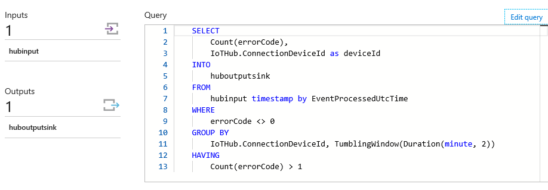

# The Things Network & Azure IoT: a perfect combination
## Receiving and handling telemetry in Azure

This is an example of how uplink messages from The Things Network can be handled in Azure. In this workshop, we will pass telemetry from your device to Azure Functions. *Note: passing back commands to your device will be added after this workshop* 


Before connecting to Azure Functions, you will first add an Azure Stream Analytics job and Azure Event Hub.

The Azure Function will execute custom code in the Cloud, bases on certain telemetry. We need Stream Analytics and the Event Hub to pass the telemetry to our function.

*Note: In this workshop, we will create uniquely named Azure resources. The suggested names could be reserved already. Just try another unique name.*

### Prerequisites

1. A running TTN node connected to the TTN network
2. Azure account [create here](https://azure.microsoft.com/en-us/free/) _([Azure passes](https://www.microsoftazurepass.com/howto) will be present for those who have no Azure account (please check your email for final confirmation))_
3. An Azure IoT Hub (created in the previous workshop)
4. A running TTN bridge on your PC and connected to an IoT Hub (or a UWP app which represents the same devices, but connected to the IoT Hub directly)
5. A running Device Explorer or IoT Hub Explorer, connected to the IoT Hub, showing the telemetry coming in (created in the previous workshop)

## Filter data in Stream Analytics and stream to event hub


Follow these steps to create an Azure Stream Analytics job which takes messages from your IoT Hub. These jobs can handle great amounts of messages, executing an SQL-like query. Stream Analytics Jobs are great for time window related queries.

*Note: in this workshop, we will not dive too deep into Stream Analytics. See for [more information](https://azure.microsoft.com/en-us/documentation/articles/stream-analytics-real-time-event-processing-reference-architecture/).*

1. `Log into` the [Azure portal](https://portal.azure.com/). You will be asked to provide Azure credentials if needed
2. On the left, select `Resource groups`. A list of resource groups is shown

    

3. Select the ResourceGroup `IoTWorkshop-rg`. It will open a new blade with all resources in this group
4. Select `Add`. A list of available services appears

    

5. Filter it with `Stream Analytics` and select `Stream Analytics job`

    

6. An introduction will be shown

    

7. Select `Create`
8. A dialog for a new Stream Analytics job is shown. Enter a unique name eg. `IoTWorkshop-sa`. A green sign will be shown if the name is unique
9. The Resource Group eg. `IoTWorkshop-rg` is already filled in
10. Select `West Europe` for the location

    

11. Select `Create` and the portal will start creating the service. Once it is created, a notification is shown

Creating an Azure Stream analytics job will take some time. Input is already known, the already existing IoT Hub; so let's create the service to send the output to, an azure Event Hub.

## Create an Azure Event Hub

Follow these steps to create an Azure Event Hub which passes large amounts of events to other services.

1. On the left, select `Resource groups`. A list of resource groups is shown

    

2. Select the ResourceGroup `IoTWorkshop-rg`. It will open a new blade with all resources in this group
3. Select `Add`. A list of available services appears

    

4. Filter it with `Event Hubs` and select `Event Hubs`

    

5. An introduction will be shown. Select `Create`
6. Event Hubs live within namespaces. So first a new namespace must be created
7. A dialog for the new namespace is shown
8. Enter a unique namespace name eg. `IoTWorkshop-ns`. A green sign will be shown if the name is unique
9. Select a pricing tier. Select the `pricing tier` selection. A 'Choose your pricing tier' section will be shown. Select the `Basic tier` or `Standard tier` and press `select`

    

10. The Resource Group eg. `IoTWorkshop-rg` is already filled in
11. Select `West Europe` for the location

    

12. Select `Create` and the portal will start creating the namespace. Once it is created, a notification is shown
13. Creating a namespace will take some time, we have to check the completion this step
14. So navigate back to the resource group (repeat step 1 and 2) and check the namespace creation in the resource group
15. If the namespace has become listed, select it, eg. `IoTWorkshop-ns`. Otherwise, 'refresh' the list of resources in the resource group a few times by pressing `Refresh` (as seen at the bottom of the screen)

    

16. You are now in the namespace blade. It should be shown like this, with all information available (otherwise, refresh a few times so Azure can show the completely generated namespace). There are no event hubs yet in this namespace:

    

17. At the top, select `Add Event Hub`

    

18. A dialog for a new Event Hub is shown. Enter a unique name eg. `IoTWorkshop-eh`. A green sign will be shown if the name is unique *Note: the name will be reverted to lower case when the Event Hub is created!*

    

19. Select `Create` and the portal will start creating the Event Hub. Once it is created, a notification is shown

    

The Event Hub is now created. But before we pass on, we need some Namespace secrets for later usage.

## Azure Event Hub namespace secrets

A few steps below we will create an Azure Functions triggered by an Event Hub. At this moment, in the editor of the Azure portal, the Azure functions can not automatically recognize available Event Hubs. We need some secrets to do it by hand.

1. Within the namespace blade, select the general setting `Shared access policies`
2. select the already available `RootManageSharedAccessKey` policy

    

3. **Write down** the Connection string `Connection String-Primary Key`
4. **Write down** the `name` of the Event Hub eg. `iotworkshop-eh` *Note: in lower case*

*Note: The Event Hub itself has Shared access policies too. We do not need to remember those, just the one of the policy of the namespace!.*

## Connecting the hubs to Azure Stream Analytics job input and output

Let's and an input source and output sink to the Stream Analytics job.

### Connecting the hubs to Azure Stream Analytics job input

As shown above, the Azure Stream Analytics job will connect to the IoT Hub. Follow these steps to define the input of Azure Stream Analytics.

1. On the left, select `Resource groups`. A list of resource groups is shown

    

2. Select the ResourceGroup `IoTWorkshop-rg`. It will open a new blade with all resources in this group
3. Select the Azure Stream Analytics job `IoTWorkshop-sa`. At this moment there are no Inputs or Outputs.

    

4. Select `Inputs`
5. Select `Add`. A dialog to add a new input is shown

    

6. Enter `hubinput` as Input alias
7. Select `IoT Hub` as Source. Because we have only one IoT Hub in our account, all other fields are automatically filled in with the right IoT Hub, `IoTWorkshop-rg`

    

8. Select `Create`

The input will be created and the connection to the hub is tested automatically. 

### Connecting the hubs to Azure Stream Analytics job output

As shown above, the Azure Stream Analytics job will connect to the Event Hub. Follow these steps to define the output of Azure Stream Analytics.

10. Select `Outputs`
11. Select `Add`. A dialog to add a new output is shown

    

12. Enter `huboutputsink` as Output alias
13. The `Event Hub` is already selected as Sink and all other fields are automatically filled in with the right Event Hub, `iotworkshop-eh` *Note: in lower case*

    

14. Change the Format into `Array`. *Note: Our output will generate JSON. And multiple lines of JSON are NOW formatted as Array, NOT as separated lines. Pleasse double check this again*
15. Select `Create`
16. The Output will be created and the connection to the hub is tested automatically. 

The output is now defined. Let's add the Azure Stream Analytics job query to connect input and output.

### Write the Azure Stream Analytics job query

Follow these steps to write the query of Azure Stream Analytics job.

1. Select `Query`
2. A new blade is shown. Here you can write your SQL-like Azure Stream Analytics job query

    

3. Write the following, very simple, query

    ```sql
    SELECT 
        Count(errorCode),
        IoTHub.ConnectionDeviceId as deviceId
    INTO
        huboutputsink
    FROM
        hubinput timestamp by EventProcessedUtcTime
    WHERE
        errorCode <> 0
    GROUP BY 
        IoTHub.ConnectionDeviceId, TumblingWindow(Duration(minute, 2))
    HAVING 
        Count(errorCode) > 1 
    ```

4. This rather simple query will collect every two minutes all devices and the number of their messages when their telemetry shows more than one error *Note: See [Introduction to Stream Analytics Window functions](https://docs.microsoft.com/en-us/azure/stream-analytics/stream-analytics-window-functions) for more information about the query language*
5. Press `Save`. Confirm if needed

    

6. Close the Query blade with the `close icon` or select `IoTWorkshop-sa` in the bread-crumbs in the top of the page

    

7. Now the Azure Stream Analytics job has both an input and an output. And we just created the query

    

8. Select `Start` to get the Stream Analytics job running

    

9. You have to provide the moment in time, the job must start retrieving data. Select `Now`. *Note: An Azure Stream Analytics job can start with telemetry from the past (if you want to rerun historical telemetry still stored in the input) or you can start at the last point the query stopped (only when applicable) or you it can start fresh only with new telemetry*

    

10. Select `Start`, this will actually start the job

Starting an Azure Stream Analytics job will take some time. After starting, all data, which is collected by the Stream Analytics job query, will be passed on to the Event Hub sink. This is the Event hub we created first. And now we are creating an Azure Function, which will be triggered by the Event Hub.

*Note: Again, this is a fairly simple example of Stream Analytics usage. The job is actually a very powerful, easy and common way to handle data and make simple choices. More in-depth usage is described [here](https://azure.microsoft.com/en-us/documentation/articles/stream-analytics-real-time-event-processing-reference-architecture/).*

## Create an Azure Function App to handle events 


Filtered and transformed messages now arrive at the Event Hub. Each time a message arrives, the Event Hub broadcast it as an event to it's 'listeners'. Let's listen to these events and act on the messages. For this, we need an Azure Function.

Follow these steps to create an Azure Function App. An Azure function is actually a real function, a couple of lines of code, which is triggered by an event and it can output the result of the code to other services. Azure Functions run 'serverless': you just write and upload your code and only pay for the number of times it is executed, the compute time and the amount of memory used. Our Azure Function will be triggered by a new event in the Event Hub. The Azure Function app is the container of Azure Functions.

1. On the left, select `Resource groups`. A list of resource groups is shown

    

2. Select the ResourceGroup `IoTWorkshop-rg`. It will open a new blade with all resources in this group
3. Select `Add`. A list of available services appears

    

4. Filter it with `Function App` and select `Function App`

    

5. An introduction will be shown. Select `Create`

    

6.  You will be asked to enter the information needed to create an Azure Function

    

7. Enter a unique App name eg. `IoTWorkshop-fa`. A green sign will be shown if the name is unique
8. The Resource Group eg. `IoTWorkshop-rg` is already filled in
9. The hosting plan is set to 'Consumption plan' by default. This means that you will only be charged for the number of times a function is executed and the resources needed for that execution. *Note: Every month, the first one million requests and 400.000 GBs are [free of charge](https://azure.microsoft.com/en-us/pricing/details/functions/)*
10. Select `West Europe` for the location
11. We also want to give the Storage Account a more meaningful name. In this storage account, the function source code etc. will be stored
12. Open de Storage Account blade and select `Create New`

    

13. Enter a unique App name eg. `iotworkshopstorage`. A green sign will be shown if the name is unique *Note: Storage account names must be all lower case!.*

    

14. Select `Ok`
15. Our new Storage Account is now added to the Azure Function App

    

16. Select `Create` 

The portal will start creating the Function app. Once it is created, a notification is shown.

## Create an NodeJs Azure Function triggered by Event Hub

Follow these steps to create an Azure Function, triggered by the Event Hub, inside the Azure Function App. 

1. On the left, select `Resource groups`. A list of resource groups is shown

    

2. Select the ResourceGroup `IoTWorkshop-rg`. It will open a new blade with all resources in this group
3. Select the Azure Function App `IoTWorkshop-fa`
4. If the Function App is not shown yet, `refresh` the list. The Function app resource will be shown in a new blade *Note: Function Apps are quite new in the Azure portal and the interface is still frequently updated*

    

5. The latest interface of Azure Functions is shown. On the left side, Select the `plus` to add a new function

    
 
6. The 'Quickstart' page is shown Here you are invited to get started quickly with a premade function. Ignore this, we will create our own custom function by hand

    

7. Select `Custom function` at the bottom 
8. We have to choose a 'trigger' template. Azure Functions are triggered by events in Azure. A list of possible triggers will be shown. At this moment there are 65+ Bash, Batch, C#, F#, JavaScript, Php, Powershell, and Python triggers. Select `JavaScript` in the language dropdown. Select the `EventHubTrigger - JavaScript` template

    

9. At the bottom of the selected template page (use the scrollbar of the current page), you have to fill in the field 'Name your function'. Change `EventHubTriggerJS1` into `IoTWorkshopEventHubFunction`
10. In the field 'Event Hub name' you will have to pass the *remembered* name of the Event Hub eg. `iotworkshop-eh` *Note: in lower case*
11. The 'Event Hub connection' field can be filled by pressing the `new` link
12. A blade with an empty list of connection strings will be shown. Press `Add a connection string`

    

13. In a new blade, enter some name in the 'Connection name' field eg. `RootManageSharedAccessKey`. A green sign will be shown if the name is correct
14. In the 'Connection string' field you will have to pass the *remembered* `Connection String-Primary Key` of the Event Hub namespace connection string. A green sign will be shown if the name is correct

    

15. Select `OK`
16. The Connection string is now filled in into the corresponding field (Give the portal a moment to check the settings)

    

17. Select `Create`

    

18. The function and trigger are saved. The develop page is shown. In the middle, you will see the function in the 'Code' panel
19. In the Logs pane, press the `arrow` (looking as a chevron) button to open that pane which shows some basic logging

    

20. A 'Logs' panel is shown. This 'Logs' panel works like a trace log.
21. Update the code a bit, change the string in the log.Info() trace call eg.

    ```javascript
    module.exports = function (context, myEventHubTrigger) {
        context.log('JavaScript processed message:', myEventHubTrigger);
    };
    ```

22. Select `Save`. The changed JavaScript code will be saved immediately *Note: you can press 'save and run', this will actually run the function, but an empty test message will be passed (check out the 'Test' option to the right for more details)*
23. Double check the code, Javascript is not compiled in advance. So no error message will appear here.

Now we are confident, the Azure function and trigger are available. 

Actually, it should be possible that there are already events produced by the EventHub...

## Receiving telemetry in the Azure Function

By now, the full chain of Azure services is set up. Telemetry from The Things Network node is passed by the bridge (or the test UWP app) to the Azure IoT Hub (as seen in one of the two explorers). Azure Stream Analytics passes a cumulation of the fault states to the Azure Function using an Azure Event Hub.

So, if your TTN node is put into a faulty state (keep the button pressed untill a red led is shown), telemetry will start arriving in the 'Logs' panel, within a few minutes.

### Sending TTN Node faults 

The TTN node sends a message every 5 seconds. For now, it's passing work cycles.

1. `Push` and `hold` the button attach to the node until the red LED is unlit. The machine is now in an 'error' state
2. `Check out` the bridge. The node is not updating the cycles anymore and error 99 is passed

    

The TTN node now simulates a machine which has stopped working. If this error is passed several times within two minutes, this is picked up by Stream Analytics. Let's check out the Azure Function

## Receiving broken machines information in the Azure Function

Machine telemetry with an error state is arriving at the Azure IoTHub. The Azure Function should pick these up

1. Telemetry will not arrive until Stream Analytics 'hops' to the next time frame. After that, you can see `telemetry arriving`

    ```
    2017-01-08T00:31:05.546 Function started (Id=b155de3d-c162-4fa4-a341-404ce83f5e84)
    2017-01-08T00:31:05.546 IoT Workshop function triggered by message: [{"count":18,"deviceid":"MachineCyclesUwp"}]
    2017-01-08T00:31:05.546 Function completed (Success, Id=b155de3d-c162-4fa4-a341-404ce83f5e84)
    2017-01-08T00:32:05.152 Function started (Id=96b403f9-2152-48b6-8bc8-78058f53fca5)
    2017-01-08T00:32:05.152 IoT Workshop function triggered by message: [{"count":24,"deviceid":"MachineCyclesUwp"}]
    2017-01-08T00:32:05.152 Function completed (Success, Id=96b403f9-2152-48b6-8bc8-78058f53fca5)
    ```

Notice that we have full control over telemetry. We know which device has sent faults at what time frame. This is great for charts or commands.

Receiving basic telemetry in Azure completes this part of the workshop. You are now ready to do something exciting with this telemetry. 

1. Let's start passing commands back to actual devices or simulated devices
    1. [Passing commands back to a The Things Uno device](CommandsTTN.md)


