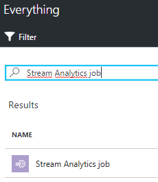
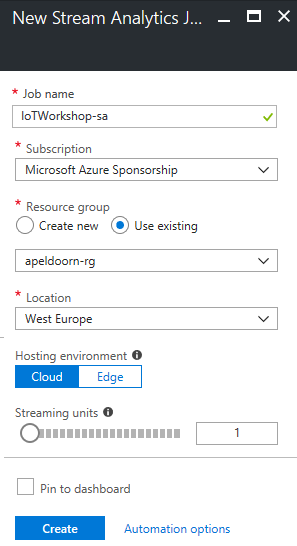
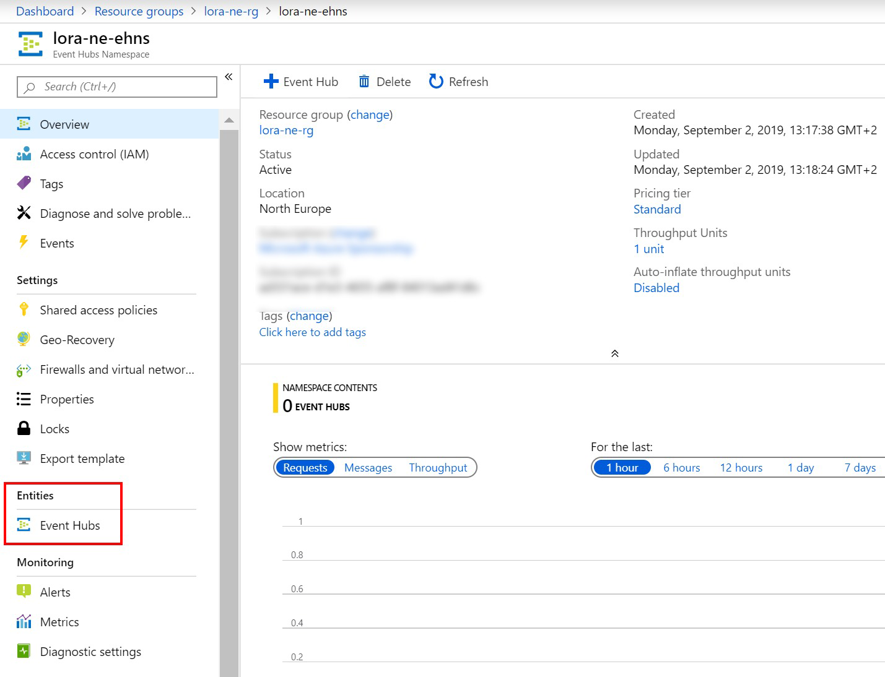
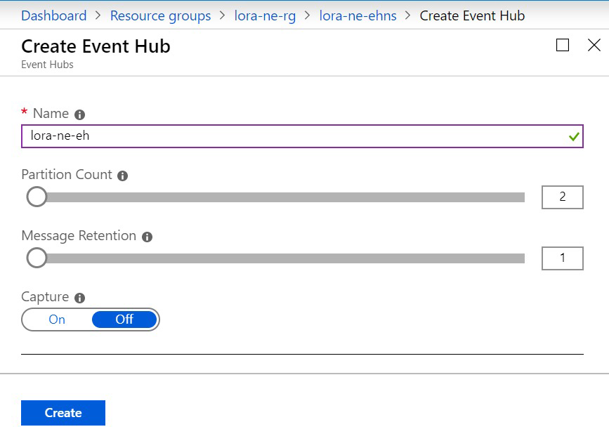
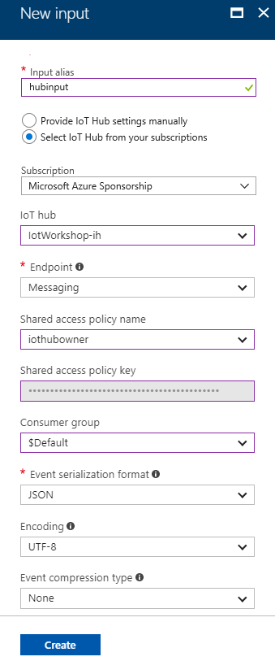
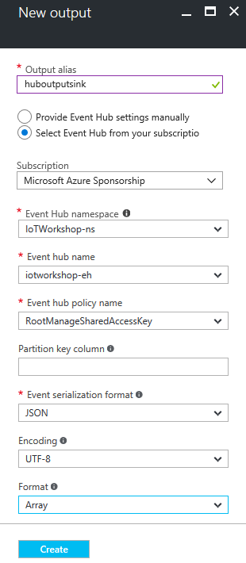
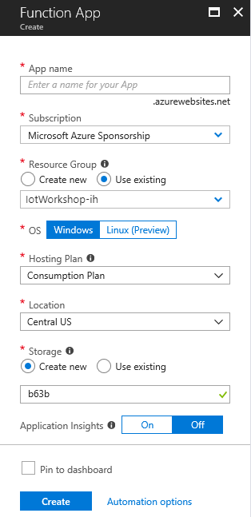
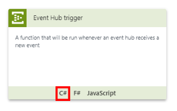
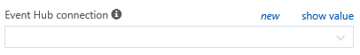
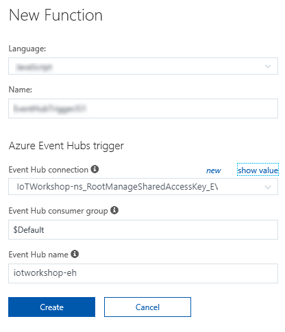

# From device to actionable insights with LoRa and the Azure IoT platform

## Receiving and handling telemetry in Azure

This is an chapter on how uplink messages from a UWP app can be handled in Azure. Here, we will pass telemetry from your device to Azure Functions. *Note: passing back commands to your device will come after this chapter*


Before connecting to Azure Functions, you will first add an Azure Stream Analytics job and Azure Event Hub.

The Stream Analytics job can make decisions with a query based on the data coming in. The Event Hub is just a way to ship a large number of events within Azure. This Event Hub is especially designed for IoT, It can hold LARGE amount of events but still it is cheap in usage.

The Azure Function will execute custom code in the Cloud, based on certain telemetry coming from Stream analytics. We need Stream Analytics and the Event Hub to pass the telemetry to our function.

*Breaking: Microsoft keeps adding new features to the Azure Platform. So StreamAnalytics is evolving too. [Recently](https://azure.microsoft.com/en-us/blog/new-in-stream-analytics-output-to-azure-functions-built-in-anomaly-detection-etc/), it has become possible to add Azure Functions directly as an output sink. This makes the extra step for the EventHub quite obsolete. In this workshop we still use the original way to communicate to make clear what's done 'under the hood'.  *

*Note: In this workshop, we will create uniquely named Azure resources. The suggested names could be reserved already. Just try another unique name.*

### Prerequisites

1. A running TTN node connected to the TTN network

2. Azure account [create here](https://azure.microsoft.com/en-us/free/) _([Azure passes](https://www.microsoftazurepass.com/howto) will be present for those who have no Azure account (please check your email for final confirmation))_

3. The Azure IoT Hub (created in the previous chapter)

4. A running Device Explorer connected to the IoT Hub, showing the telemetry coming in (created in the previous chapter)

### Steps to perform in this part of the workshop

At the end of this part of the workshop, the following steps are performed

1. Filter data in Stream Analytics and stream to EventHub

2. Create an Azure Event Hub

3. Connecting the hubs to Azure Stream Analytics job input and output

4. Write the Azure Stream Analytics job query

5. Create an Azure Function App to handle events

6. Receiving telemetry in the Azure Function

7. Conclusion

## Filter data in Stream Analytics and stream to EventHub


Follow these steps to create an Azure Stream Analytics job which takes messages from your IoT Hub. These jobs can handle great amounts of messages, executing an SQL-like query. Stream Analytics Jobs are great for time window related queries.

*Note: in this workshop, we will not dive too deep into Stream Analytics. See for [more information](https://azure.microsoft.com/en-us/documentation/articles/stream-analytics-real-time-event-processing-reference-architecture/).*

1. `Log into` the [Azure portal](https://portal.azure.com/). You will be asked to provide Azure credentials if needed

2. On the left, select `Resource groups`. A list of resource groups is shown

    

3. Select the ResourceGroup `IoTWorkshop-rg`. It will open a new blade with all resources in this group

4. Select `Add`. A list of available services appears

    

5. Filter it with `Stream Analytics` and select `Stream Analytics job`

    

6. An introduction will be shown

    

7. Select `Create`

8. A dialog for a new Stream Analytics job is shown. Enter a unique name eg. `IoTWorkshop-sa`. A green sign will be shown if the name is unique

9. The Resource Group eg. `IoTWorkshop-rg` is already filled in

10. Select `West Europe` for the location

    

11. Select `Create` and the portal will start creating the service. Once it is created, a notification is shown

Creating an Azure Stream analytics job will take some time.

But before we move on, we have to create an output resource. A Stream Analytics job ingests data from an input, runs a script continuously and sends conditional data to an output sink.

The input is already known, that is the already existing IoT Hub; so let's create the output resource behind the sink to send the output to, an azure Event Hub.

## Create an Azure Event Hub

Follow these steps to create an Azure Event Hub which passes large amounts of events to other services.

1. On the left, select `Resource groups`. A list of resource groups is shown

    

2. Select the ResourceGroup `IoTWorkshop-rg`. It will open a new blade with all resources in this group

3. Select `Add`. A list of available services appears

    

4. Filter it with `Event Hubs` and select `Event Hubs`

    

5. An introduction will be shown. Select `Create`

    

6. Event Hubs live within namespaces which can be seen as an administrative container for EventHubs. So first, a new namespace must be created

7. A dialog for the new namespace is shown

8. Enter a unique namespace name eg. `IoTWorkshop-ns`. A green sign will be shown if the name is unique

9. Select a pricing tier. Select the `pricing tier` selection. A 'Choose your pricing tier' section will be shown. Select the `Basic tier` or `Standard tier` and press `select`

    

10. The Resource Group eg. `IoTWorkshop-rg` is already filled in

11. Select `West Europe` for the location

    

12. Select `Create` and the portal will start creating the namespace. Once it is created, a notification is shown

13. Creating a namespace will take some time, we have to check the completion this step

14. So `navigate back` to the resource group (repeat step 1 and 2) and `check the namespace creation` in the resource group

15. If the namespace has become listed, select it, eg. `IoTWorkshop-ns`. Otherwise, 'refresh' the list of resources in the resource group a few times by pressing `Refresh` (as seen at the bottom of the screen)

    

16. You are now in the namespace blade. It should be shown like this, with all information available (otherwise, refresh a few times so Azure can show the completely generated namespace). There are no event hubs yet in this namespace:

    

17. At the top, select `Add Event Hub`

    

18. A dialog for a new Event Hub is shown. Enter a unique name eg. `IoTWorkshop-eh`. A green sign will be shown if the name is unique *Note: the name will be reverted to lower case when the Event Hub is created!*

    

19. Select `Create` and the portal will start creating the Event Hub. Once it is created, a notification is shown

    

The Event Hub is now created. But before we pass on, we need some Namespace secrets for later usage.

### Azure Event Hub namespace secrets

A few steps below we will create an Azure Functions triggered by an Event Hub. At this moment, in the editor of the Azure portal, the Azure functions can not automatically recognize available Event Hubs. We need some secrets to do it by hand.

Previously, in the (preview) Azure Functions part of the Azure portal, the Azure functions could not automatically recognize available Event Hubs. We needed to remember some secrets.

Just to be known with the security features on an EventHub, let's look at the Shared access policies of the namespace

1. Within the namespace blade, select the general setting `Shared access policies`

2. select the already available `RootManageSharedAccessKey` policy

    

3. Look at the Connection string `Connection String-Primary Key`

4. Look at the `name` of the Event Hub eg. `iotworkshop-eh` *Note: in lower case*

5. You can see that if you want to read and/or listen too and/or manage EventHubs, you need access to the policy

*Note: The Event Hub itself has Shared access policies too. You have looked at the policy of the namespace, applicable for all EventHubs!.*

## Connecting the hubs to Azure Stream Analytics job input and output

Let's and an input source and output sink to the Stream Analytics job.

### Connecting the hubs to Azure Stream Analytics job input

As shown above, the Azure Stream Analytics job will connect to the IoT Hub. Follow these steps to define the input of Azure Stream Analytics.

1. On the left, select `Resource groups`. A list of resource groups is shown

    

2. Select the ResourceGroup `IoTWorkshop-rg`. It will open a new blade with all resources in this group

3. Select the Azure Stream Analytics job `IoTWorkshop-sa`. At this moment there are no Inputs or Outputs.

    

4. Select `Inputs`

5. Select `Add`. A dialog to add a new input is shown

    

6. Enter `hubinput` as Input alias

7. Select `IoT Hub` as Source. Because we have only one IoT Hub in our account, all other fields are automatically filled in with the right IoT Hub, `IoTWorkshop-rg`

    

8. Select `Create`

The input will be created and the connection to the hub is tested automatically.

### Connecting the EventHub to Azure Stream Analytics job output

As shown above, the Azure Stream Analytics job will connect to the Event Hub. Follow these steps to define the output of Azure Stream Analytics.

1. `Go back` to the StreamAnalytics job opening page and now Select `Outputs`

2. Select `Add`. A dialog to add a new output is shown

    

3. Enter `huboutputsink` as Output alias

4. The `Event Hub` is already selected as Sink (if multiple EventHubs are available, check if the right one is selected) and all other fields are automatically filled in with the right Event Hub, `iotworkshop-eh` *Note: in lower case* _(**Warning** What if the EventHub does not show up? Add it by hand)_

    

5. Do not forget to `change` the Format into `Array`. *Note: Our output will generate JSON. And multiple lines of JSON are NOW formatted as Array, NOT as separated lines. Please double check this again*

6. Select `Create`

7. The Output will be created and the connection to the hub is tested automatically.

The output is now defined. Let's add the Azure Stream Analytics job query to connect input and output.

## Write the Azure Stream Analytics job query

Follow these steps to write the query of Azure Stream Analytics job.

1. Select `Query`

2. A new blade is shown. Here you can write your SQL-like Azure Stream Analytics job query

    

3. Write the following, very simple, query

    ```sql
    SELECT
        Count(errorCode),
        IoTHub.ConnectionDeviceId as deviceId
    INTO
        huboutputsink
    FROM
        hubinput timestamp by EventProcessedUtcTime
    WHERE
        errorCode <> 0
    GROUP BY
        IoTHub.ConnectionDeviceId, TumblingWindow(Duration(minute, 2))
    HAVING
        Count(errorCode) > 1
    ```

4. This rather simple query will collect every two minutes all devices and the number of their messages when their telemetry shows more than one error (not equal to zero) *Note: See [Introduction to Stream Analytics Window functions](https://docs.microsoft.com/en-us/azure/stream-analytics/stream-analytics-window-functions) for more information about the query language*

5. Press `Save`. Confirm if needed

    

6. Close the Query blade with the `close icon` or select `IoTWorkshop-sa` in the bread-crumbs in the top of the page

    

7. Now the Azure Stream Analytics job has both an input and an output. And we just created the query

    

8. Select `Start` to get the Stream Analytics job running

    

9. `Provide` 'the moment in time' the job must pick to start retrieving data. Select `Now`. *Note: An Azure Stream Analytics job can start with telemetry from the past (if you want to rerun historical telemetry still stored in the input) or you can start at the last point the query stopped (only when applicable) or you can start it fresh only with new telemetry*

    

10. Select `Start`, this will actually start the job

Starting an Azure Stream Analytics job will take some time. After starting, all data, which is collected by the Stream Analytics job query, will be passed on to the Event Hub sink. This is the Event hub we created first. And now we are creating an Azure Function, which will be triggered by the Event Hub.

*Note: Again, this is a fairly simple example of Stream Analytics usage. The job is actually a very powerful, easy and common way to handle data and make simple choices. More in-depth usage is described [here](https://azure.microsoft.com/en-us/documentation/articles/stream-analytics-real-time-event-processing-reference-architecture/).*

## Create an Azure Function App to handle events


Filtered and transformed messages now arrive at the Event Hub. Each time a message arrives, the Event Hub broadcast it as an event to its 'subscribers'. Let's listen to these events and act on the messages. For this, we need an Azure Function.

Follow these steps to create an Azure Function App. An Azure function is actually a real function, a couple of lines of code, which is triggered by an event and it can output the result of the code to other services. Azure Functions run 'serverless': you just write and upload your code and only pay for the number of times it is executed, the compute time and the amount of memory used. Our Azure Function will be triggered by a new event in the Event Hub. The Azure Function app is the container of Azure Functions.

1. On the left, select `Resource groups`. A list of resource groups is shown

    

2. Select the ResourceGroup `IoTWorkshop-rg`. It will open a new blade with all resources in this group

3. Select `Add`. A list of available services appears

    

4. Filter it with `Function App` and select `Function App`

    

5. An introduction will be shown

    

6. Select `Create`

    

7. You will be asked to enter the information needed to create an Azure Function

    

8. Enter a unique App name eg. `IoTWorkshop-fa`. A green sign will be shown if the name is unique

9. The Resource Group eg. `IoTWorkshop-rg` is already filled in

10. The hosting plan is set to 'Consumption plan' by default. This means that you will only be charged for the number of times a function is executed and the resources needed for that execution. *Note: Every month, the first one million requests and 400.000 GBs are [free of charge](https://azure.microsoft.com/en-us/pricing/details/functions/)*

11. Select `West Europe` for the location

12. We also want to give the `Storage Account` a more meaningful name. In this storage account, the function source code (files) etc. will be stored

13. Enter a unique Storage name eg. `iotworkshopstorage`. A green sign will be shown if the name is unique *Note: Storage account names must be all lower case!.*

14. Our new Storage Account is now added to the Azure Function App

    

15. Select `Create`

The portal will start creating the Function app. Once it is created, a notification is shown.

### Create a C# Azure Function triggered by Event Hub

Follow these steps to create an Azure Function, triggered by the Event Hub, inside the Azure Function App.

1. On the left, select `Resource groups`. A list of resource groups is shown

    

2. Select the ResourceGroup `IoTWorkshop-rg`. It will open a new blade with all resources in this group

3. Select the Azure Function App `IoTWorkshop-fa`

4. If the Function App is not shown yet, `refresh` the list. The Function app resource will be shown in a new blade *Note: Function Apps are quite new in the Azure portal and the interface is still frequently updated*

    

5. The latest interface of Azure Functions is shown. On the left side, Select the `plus` to add a new function

    

6. The 'Quickstart' page is shown Here you are invited to get started quickly with a premade function. Ignore this, we will create our own custom function by hand

    

7. Select `Custom function` at the bottom

8. We have to choose a 'trigger' template. Azure Functions are triggered by events in Azure. A list of possible triggers will be shown. At this moment there are 65+ Bash, Batch, C#, F#, JavaScript, PHP, Powershell Python and TypeScript triggers. Select the `EventHubTrigger - C#` template

    

9. At the bottom of the selected template page (use the scrollbar of the current page), you have to fill in the field 'Name your function'. Change `EventHubTriggerCSharp1` into `IoTWorkshopEventHubFunction`

10. We do not have to remember EventHub credentials anymore. Next to the field 'Event Hub connection' select `new`

    

11. A new dialog is shown. The needed 'Event Hub connection' is filled in already or you can `select` it using the drop downs. Do you see the policy of then namespace?

    

12. Press `Select` to continue. You are back to the input fields

13. `Fill in` 'iotworkshop-eh' in the Event Hub name field

14. The Connection string is now filled in into the corresponding field

    

15. Select `Create`

    

16. The function and trigger are saved. The develop page is shown. In the middle, you will see the function in the 'Code' panel

17. In the Logs pane, press the `arrow` (looking like a chevron) button to open that pane which shows some basic logging

    

18. A 'Logs' panel is shown. This 'Logs' panel works like a trace log.

19. Update the code a bit, change the string in the log.Info() trace call eg.

    ```csharp
    using System;

    public static void Run(string myEventHubMessage, TraceWriter log)
    {
        log.Info($"IoT Workshop function triggered by message: {myEventHubMessage}");
    }
    ```

20. Select `Save`. The changed C# code will be recompiled immediately *Note: you can press 'save and run', this will actually run the function, but an empty test message will be passed (check out the 'Test' option to the right for more details)*

21. In the 'Logs' panel, just below 'Code', `verify the outcome` of the compilation

    ```cmd/sh
    2017-01-08T00:14:24.981 Script for function 'IoTWorkshopEventHubFunction' changed. Reloading.
    2017-01-08T00:14:25.122 Compilation succeeded.
    ```

Now we are confident, the Azure function and trigger are available.

## Receiving telemetry in the Azure Function

By now, the full chain of Azure services is set up. Telemetry from The Things Network node is passed by the bridge (or the test UWP app) to the Azure IoT Hub (as seen in one of the two explorers). Azure Stream Analytics passes a cumulation of the fault states to the Azure Function using an Azure Event Hub.

So, if your UWP is put into a faulty state, telemetry will start arriving in the 'Logs' panel.

### Sending UWP app faults

If you are using the UWP app as simulator for a node, you have to 'break' the machine by hand

1. start the UWP app, 'complete' a couple of cycles and then press the `Break down` button. The UWP app simulates now a machine which has a certain fault status eg. '99'. *Note: the interface will show the title in red when the 'machine' is broken*

    

2. Press the `Send cycles updates` button to send the new telemetry. Press the button _multiple times_ within the same time frame of two minutes to match the query in Stream Analytics.

    

The UWP app now simulates a machine which has stopped working. If this error is passed several times within two minutes, this is picked up by Stream Analytics. Let's check out the Azure Function

### Receiving broken machines information in the Azure Function

Machine telemetry with an error state is arriving at the Azure IoTHub. The Azure Function should pick these up _(Note: be aware of the two minute cumulations)_

1. Telemetry will not arrive until Stream Analytics 'hops' to the next time frame. After that, you can see `telemetry arriving`

    ```cmd/sh
    2017-01-08T00:31:05.546 Function started (Id=b155de3d-c162-4fa4-a341-404ce83f5e84)
    2017-01-08T00:31:05.546 IoT Workshop function triggered by message: [{"count":18,"deviceid":"MachineCyclesUwp"}]
    2017-01-08T00:31:05.546 Function completed (Success, Id=b155de3d-c162-4fa4-a341-404ce83f5e84)
    2017-01-08T00:32:05.152 Function started (Id=96b403f9-2152-48b6-8bc8-78058f53fca5)
    2017-01-08T00:32:05.152 IoT Workshop function triggered by message: [{"count":24,"deviceid":"MachineCyclesUwp"}]
    2017-01-08T00:32:05.152 Function completed (Success, Id=96b403f9-2152-48b6-8bc8-78058f53fca5)
    ```

Notice that we have full control over telemetry. We know which device has sent faults at what time frame. This is great for charts or commands.

Also notice the result is sent as an JSON Array, just as configured in the StreamAnalytics output sink. And because it's an array, we could enumerate through all devices passed.

## Conclusion

Receiving basic telemetry in Azure completes this part of the workshop. You are now ready to do something exciting with this telemetry. Let's look at commands...

Let's start [passing commands back to actual devices or simulated devices](CommandsUwp.md)

 