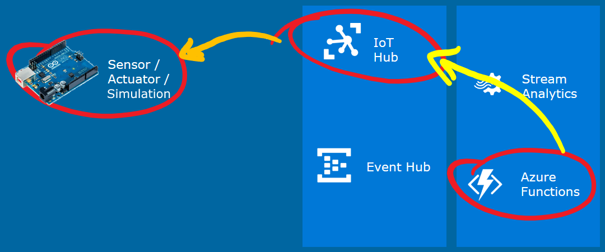
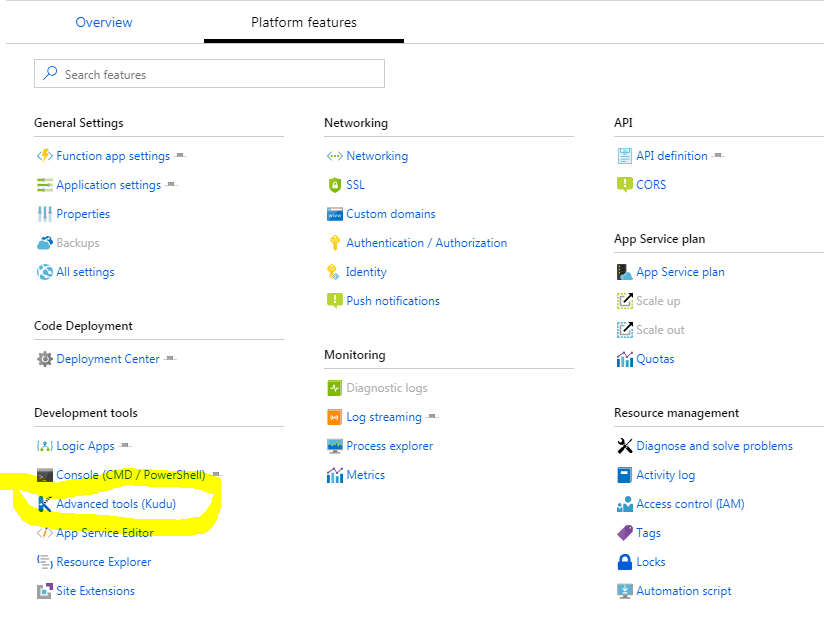
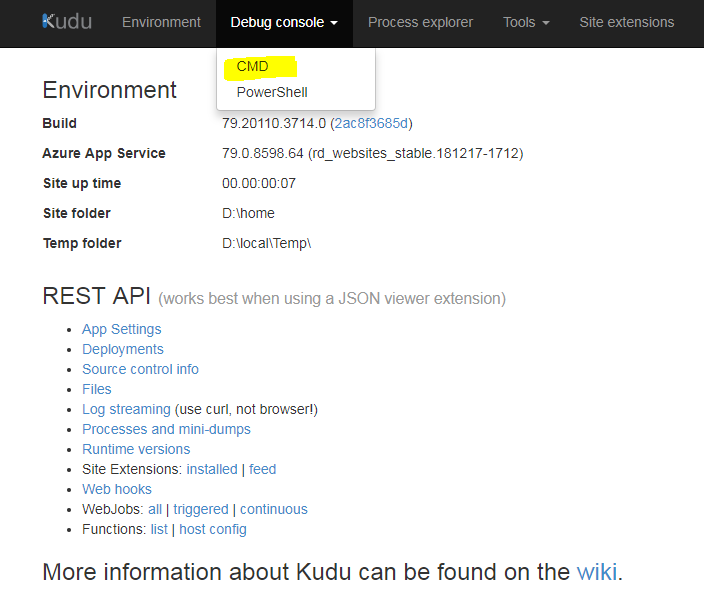
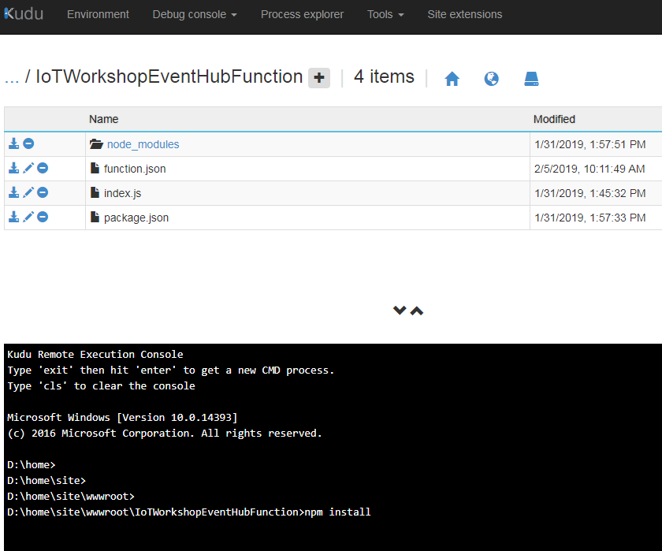

# From device to actionable insights with LoRa and the Azure IoT platform

## Passing commands back to a device

This is an example of how downlink commands are sent back to a device. In this workshop, we will send commands back to faulty devices, using an Azure Function, to start them up again.



This part of the workshop supports both the [NodeJs app](NodeJsToIotHub.md) and the [Java app](JavaToIotHub.md).

*Note: In this workshop, we will create uniquely named Azure resources. The suggested names could be reserved already.*

### Prerequisites

1. A running NodeJs or Java app which simulates a machine running duty cycles

2. A combination of Azure IoT Hub, Stream Analytics job, Event Hub and Azure Function which are waiting for analyzed telemetry coming from the devices

3. Azure account [create here](https://azure.microsoft.com/en-us/free/) _(Azure passes will be present for those who have no Azure account (please check your email for final confirmation))_

### Steps to perform in this part of the workshop

At the end of this part of the workshop, the following steps are performed

1. Sending back commands for devices which are in a faulty state

2. Handle commands in the devices

## Sending back commands for devices which are in a faulty state


In the [previous chapter](AzureNodeJs.md), we passed the telemetry from the device to a Stream Analytics job. 

This job collected devices which are sending error states. 

Every two minutes, information about devices that are in a faulty state are passed to an Azure Function.

In this workshop, we will react on these devices by sending them a command to 'repair themselves'.

### Updating the NodeJs Azure Function with sending command logic

First, we update the Azure Function. For each device which is passed on, we send a command back.

Sending commands back to devices is a specific feature of the IoT Hub. The IoT Hub registers devices and their security policies. And the IoT Hub has built-in logic to send commands back.

1. On the left, select **Resource groups**. A list of resource groups is shown

    

2. Select the ResourceGroup **IoTWorkshop-rg**. It will open a new blade with all resources in this group

3. Select the Azure Function App **IoTWorkshop-fa**

4. To the left, the current functions are shown. Select **IoTWorkshopEventHubFunction**

    

5. The Code panel is shown. The code of the function is shown. *Note: actually, this code is saved in a JavaScript file named index.js in the Azure storage of the Function app*

6. Change the current code into

    ```javascript
    module.exports = function (context, myEventHubTrigger) {
        context.log('Stream Analytics produced: ', myEventHubTrigger);

        var Client = require('azure-iothub').Client;
        var Message = require('azure-iot-common').Message;

        var connectionString = "[IOT HUB connection string]";
        var serviceClient = Client.fromConnectionString(connectionString);

        function printResultFor(op) {
            return function printResult(err, res) {
                if (err) context.log(op + ' error: ' + err.toString());
                if (res) context.log(op + ' status: ' + res.constructor.name);
            };
        }

        function receiveFeedback(err, receiver){
            receiver.on('message', function (msg) {
                context.log('Feedback message:')
                context.log(msg.getData().toString('utf-8'));
            });
        }

        serviceClient.open(function (err) {
            if (err) {
                context.log('Could not connect: ' + err.message);
            } else {
                context.log('Service client connected');
                serviceClient.getFeedbackReceiver(receiveFeedback);

                var message = new Message('*'); // * = ascii 42

                context.log('Sending message: ' + message.getData());

                for(i = 0; i < myEventHubTrigger.length; i ++) {
                    var targetDevice = myEventHubTrigger[i].deviceid;
                    context.log('Sending message to: ' + targetDevice);
                    serviceClient.send(targetDevice, message, printResultFor('send'));
                }
            }
        });

        context.done();
    };
    ```

7. Press the **Logs** button at the bottom to open the pane which shows some basic logging

    

8. A 'Logs' panel is shown. This 'Logs' panel works like a trace log.

9. Because we are writing JavaScript, there will be no warning the code above has some flaws. We need to add a connection string and extra libraries. Let's start with the extra libraries.

10. Press the **View Files** button to 'unfold' the pane which shows a directory tree of all files.

    

11. In the pane you can see that the file currently selected is: index.js

    

12. Add a new file by pressing **Add**

    

13. Name the new file **package.json**

    

14. Press **Enter** to confirm the name of the file and an empty code editor will be shown for this file.

15. The 'package.json' file describes which NodeJS packages have to be referenced. Fill the editor with the following code

    ```json
    {
      "name": "azure-javascript-function",
      "version": "1.0.0",
      "description": "",
      "main": "index.js",
      "author": "",
      "license": "",
      "dependencies": {
        "azure-iothub": "^1.3.0"
      }
    }
    ```

16. Select **Save**.

17. Return to the file **index.js**. Paste the connection string of your IoT Hub in the variable **connectionString** on line 7.

18. Go to **IoTWorkshop-fa**, **Platform Features**, **Development tools**, **Advanced tools (Kudu)**

    

19. Select **Debug console** and **CMD**

    

20. Navigate to **D:\\home\\site\\wwwroot\\IoTWorkshopEventHubFuction** or **D:\\home\\site\\wwwroot\\\<your function>**

    

21. In the console window type 'npm install', this can take some time to complete. This is needed to install the required Node.js packages on Azure.


Now, the Azure Function is ready to receive data about devices which simulate 'faulty machines'. And it can send commands back to 'repair' the 'machines'.

## Handle commands in the devices


Let's check if your device in already in a faulty state and see how the Azure IoT Platforms sends back a command to repair it.

### Handle commands in the javascript Node.js app

The javascript client is instrumented to fall into an error state already, every fifth "completed cycle" message results in an error state. This will put the device in an error state.

Just wait for approx. two minutes and see how the error state arrives at the IoT Hub and within two minutes the command is generated to 'fix' the machine.

Again, after five successfull cycles, the app will generate another error state, which will eventually be fixed automatically.

### Handle commands in the javascript Node.js app

The Java client is instrumented to fall into an error state already, every fifth "completed cycle" message results in an error state. This will put the device in an error state.

Just wait for approx. two minutes and see how the error state arrives at the IoT Hub and within two minutes the command is generated to 'fix' the machine.

Again, after five successfull cycles, the app will generate another error state, which will eventually be fixed automatically.

## Conclusion

Receiving commands from Azure completes the main part of the workshop.

We hope you did enjoy working with the Azure IoT Platform, as much as we did. Thanks for getting this far!


And for more creative ideas, we can recommand to look at [hackster.io](https://www.hackster.io/). Every day, new IoT projects are added!

 
