# The Things Network & Azure IoT: a perfect combination
## Passing commands back to a device

This is an example of how downlink commands are sent back to a device. In this workshop, we will send commands back to faulty devices, using an Azure Function, to start them up again. 

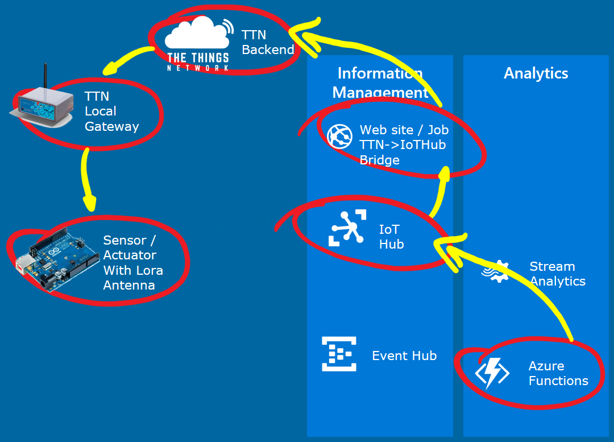

This part of the workshop supports the [TTN Node](TheThingsNetwork.md). 

*Note: In this workshop, we will create uniquely named Azure resources. The suggested names could be reserved already.*

### Prerequisites

1. Azure account [create here](https://azure.microsoft.com/en-us/free/) _(Azure passes will be present for those who have no Azure account (please check your email for final confirmation))_
2. A running TTN node connected to the TTN network and a running TTN bridge on your PC and connected to an IoT Hub
3. A combination of Azure IoT Hub, Stream Analytics job, Event Hub and Azure Function which are waiting for analyzed telemetry coming from the devices
4. A running IoT Hub Explorer, connected to the IoT Hub, showing the telemetry coming in

### Steps to perform in this part of the workshop

At the end of this part of the workshop, the following steps are performed

1. Creating commands to send back in the Azure Function
2. Handle commands in the TTN Node

## Sending back commands for devices which are in a faulty state

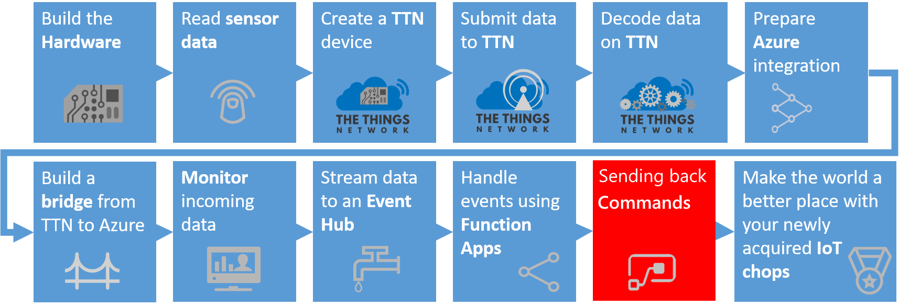

In the [previous chapter](AzureTTN.md), we passed the telemetry from the device to a Stream Analytics job. This job collected devices which are sending error states. Every two minutes, information about devices that are in a faulty state are passed to an Azure Function.

In this workshop, we will react on these devices by sending them a command to 'repair themselves'. 

### Updating the NodeJs Azure Function with sending command logic

First, we update the Azure Function. For each device which is passed on, we send a command back.

Sending commands back to devices is a specific feature of the IoT Hub. The IoT Hub registers devices and their security policies. And the IoT Hub has built-in logic to send commands back.

1. On the left, select `Resource groups`. A list of resource groups is shown

    

2. Select the ResourceGroup `IoTWorkshop-rg`. It will open a new blade with all resources in this group
3. Select the Azure Function App `IoTWorkshop-fa`
4. To the left, the current functions are shown. Select `IoTWorkshopEventHubFunction`

    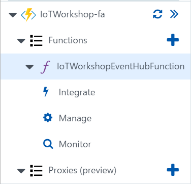

5. The Code panel is shown. The code of the function is shown. *Note: actually, this code is saved in a JavaScript file named index.js*
6. Change the current code into

    ```javascript
    module.exports = function (context, myEventHubTrigger) {
        context.log('Stream Analytics produced: ', myEventHubTrigger);

        var Client = require('azure-iothub').Client;
        var Message = require('azure-iot-common').Message;

        var connectionString = "[IOT HUB connection string]";
        var serviceClient = Client.fromConnectionString(connectionString);
    
        function printResultFor(op) {
            return function printResult(err, res) {
                if (err) context.log(op + ' error: ' + err.toString());
                if (res) context.log(op + ' status: ' + res.constructor.name);
            };
        }

        function receiveFeedback(err, receiver){
            receiver.on('message', function (msg) {
                context.log('Feedback message:')
                context.log(msg.getData().toString('utf-8'));
            });
        }

        serviceClient.open(function (err) {
            if (err) {
                context.log('Could not connect: ' + err.message);
            } else {
                context.log('Service client connected');
                serviceClient.getFeedbackReceiver(receiveFeedback);

                var message = new Message('*'); // * = ascii 42

                context.log('Sending message: ' + message.getData());
    
                for(i = 0; i < myEventHubTrigger.length; i ++) {
                    var targetDevice = myEventHubTrigger[i].deviceid;
                    context.log('Sending message to: ' + targetDevice);
                    serviceClient.send(targetDevice, message, printResultFor('send'));
                }
            }
        });

        context.done();
    };
    ```

7. Press the `Logs` button at the bottom to open the pane which shows some basic logging

    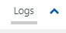

8. A 'Logs' panel is shown. This 'Logs' panel works like a trace log.
9. Because we are writing JavaScript, there will be no warning the code above has some flaws. We need to add a connection string and extra libraries. Let's start with the extra libraries.
10. Press the `View Files` button to 'unfold' the pane which shows a directory tree of all files.

    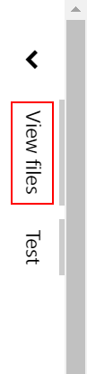

11. In the pane you can see that the file currently selected is: index.js

    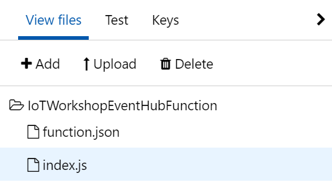

12. Add a new file by pressing `Add`

    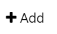

13. Name the new file `project.json`

    

14. Press `Enter` to confirm the name of the file and an empty code editor will be shown for this file.
15. The Project.json file describes which Nuget packages have to be referenced. Fill the editor with the following code 

    ```json
    {
      "name": "azure-javascript-function",
      "version": "1.0.0",
      "description": "",
      "main": "index.js",
      "author": "",
      "license": "",
      "dependencies": {
        "azure-iot-device": "^1.1.7",
        "azure-iot-device-amqp": "^1.1.7",
        "azure-iothub": "^1.1.7",
      }
    }
    ```

16. Select `Save`.
17. We have added the extra dependencies. Unfortunately the libraries involved are not loaded yet. We have to tell NodeJs to load the new libraries. *Note: you can press 'save and run', this will actually try to run the function, but an empty test will be passed (check out the 'Test' option to the right for more info)*
18. To the left, press the `Function app settings` button

    

19. We want to run a NodeJs command. Select the `Go to Kudu` option

    

20. A new tab page is shown. In it the file structure of the NodeJs function is shown. And we get an convenient Dosprompt
21. navigate to the map `D:\home\site\wwwroot\IoTWorkshopEventHubFunction` using the files shown in the upper half of the screen
22. Run `npm install` in the console. *Note: This could take some time*

    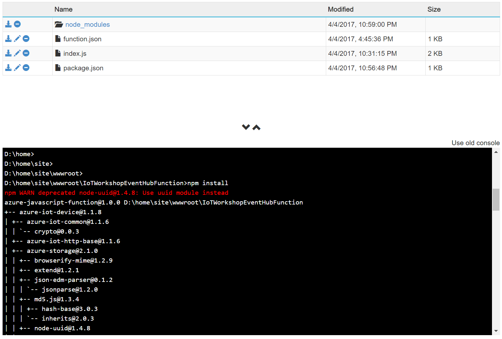

23. Once the cursor is available again, close the Kudu screen and return to the NodeJs function
24. There is just one thing left to do: we have to fill in the Azure IoT Hub security policy connection string. To send commands back, we have to proof we are authorized to do this
25. In the Azure Function, replace '[IOT HUB connection string]' with your *remembered* IoT Hub `Connection String-primary key`
26. Select `Save` again 

Now, the Azure Function is ready to receive data about devices which simulate 'faulty machines'. And it can send commands back to 'repair' the 'machines'.

## Handle commands in the devices


Let's bring your device in a faulty state and see how the Azure IoT Platforms sends back a command to repair it.

### Handle commands in the TTN Node

In [TTN Node](TheThingsNetwork.md), we assembled a TTN node and we put a sketch (source code) on it. Here we will add more logic to the node.

1. Go back to the Arduino IDE and select the sketch
2. Alter the sketch, Add the 'ttn.onMessage(handleCommand);' in the setup function:

    ```c
    // Initializing TTN communication...
    ttn.onMessage(handleCommand); // new: Handle downlink
    ttn.personalize(devAddr, nwkSKey, appSKey);
    ```

3. Every time a message is sent to the TTN backend, the node checks for commands. When a command is received, the handleCommand function will be called
4. Add the extra function 'handleCommand' at the end of the sketch

    ```c
    void handleCommand(const byte* payload, size_t length, port_t port) {
      if (length > 0) {
        int command = payload[0];

        if (command >= 42) {
          errorCode = 0;
          bar.setLed(1,0);
          debugSerial.println("Machine repaired...");
        }
      }
    } 
    ```

5. In the **Sketch** menu, click **Upload**. *Note: The sketch is uploaded and again telemetry will arrive at the TTN Portal, the TTN Azure bridge and the IoTHub*
6. **Push** the button attached to the node and `hold` it until the LED is unlit. The 'machine' is now in an 'error' state
7. **Check out** the bridge. The node is not updating the cycles anymore and error 99 is passed

    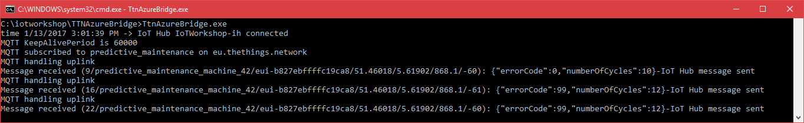

8. After a few errors within two minutes (the same time frame Stream Analytics is checking), **Check out** the Azure Function. It will handle the event message.

    ```
    2017-01-13T14:09:17.188 Function started (Id=ed3a2175-33e6-4698-a76c-5831b2ea86a1)
    2017-01-13T14:09:17.646 Stream Analytics produced [{"count":2,"deviceid":"predictive_maintenance_machine_42"}]
    2017-01-13T14:09:17.724 1 messages arrived.
    2017-01-13T14:09:17.833 Machine restart command processed after 2 errors for predictive_maintenance_machine_42
    2017-01-13T14:09:17.833 Function completed (Success, Id=ed3a2175-33e6-4698-a76c-5831b2ea86a1)
    ```

9. **Check out** the bridge again. It will now handle the command (Downlink message) and send it to the TTN portal

    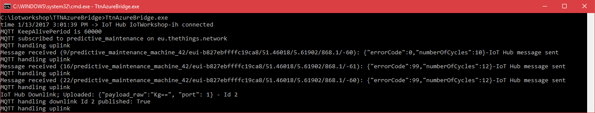

10. **Check out** the TTN portal, the data pane. It will now handle the command (Downlink message) and send it to the device, one the first moment a new uplink message arrives

    

11. Finally, **check out** the logging of the node. The commands arrives and is handled by the function in the sketch

    

12. And in the end, the device will dim the red LED and lit the light of the working LED again. The 'machine' is now running again

We have now gone full circle: the machine on hold (in an error state), simulated by the TTN Node, is running again and it's updating the machine cycles number again. And again, it's running without an error state.

## Conclusion

Receiving commands from Azure completes the main part of the workshop.

We hope you did enjoy working with the Azure IoT Platform, as much as we did. Thanks for getting this far!

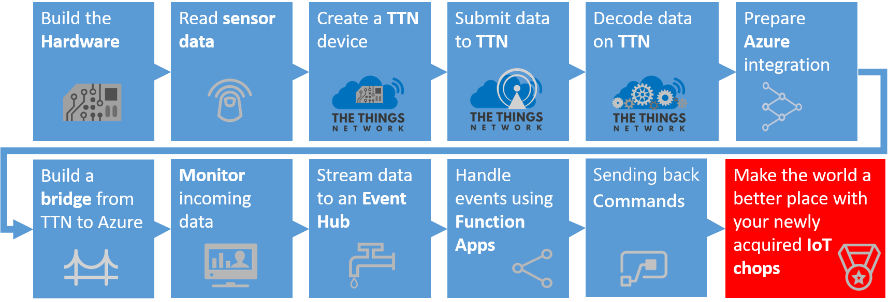

But wait, there is still more. We added two bonus chapters to the workshop

1. [Deploying the TTN C# bridge as Azure Web Job](Webjob.md)
2. [Add basic monitoring to the platform](IoTPatformMonitoring.md)


