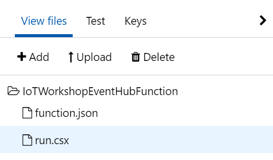
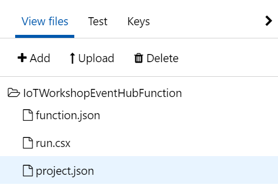
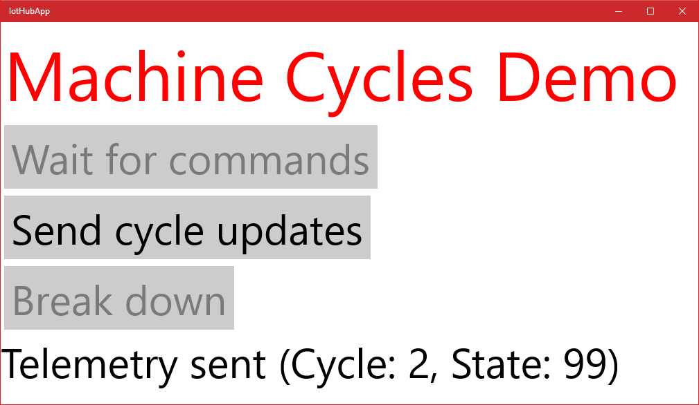

# From device to actionable insights with LoRa and the Azure IoT platform

## Passing commands back to a device

This is an example of how downlink commands are sent back to a device. In this workshop, we will send commands back to faulty devices, using an Azure Function, to start them up again.


This part of the workshop supports the [UWP app](UwpToIotHub.md).

*Note: In this workshop, we will create uniquely named Azure resources. The suggested names could be reserved already.*

### Prerequisites

1. A running UWP app which simulates a machine running duty cycles

2. A combination of Azure IoT Hub, Stream Analytics job, Event Hub and Azure Function which are waiting for analyzed telemetry coming from the devices

3. Azure account [create here](https://azure.microsoft.com/en-us/free/) _(Azure passes will be present for those who have no Azure account (please check your email for final confirmation))_

### Steps to perform in this part of the workshop

At the end of this part of the workshop, the following steps are performed

1. Sending back commands for devices which are in a faulty state
2. Updating the C# Azure Function with sending command logic
3. Handle commands in the devices
4. Conclusion

## Sending back commands for devices which are in a faulty state


In the [previous chapter](AzureUWP.md), we passed the telemetry from the device to a Stream Analytics job. This job collected just the devices which are sending error states. Every two minutes, information about devices that are in a faulty state are passed to an Azure Function.

In this chapter, we will react on these devices by sending them a command to 'repair themselves'.

## Updating the C# Azure Function with sending command logic

First, we update the Azure Function. For each device which is passed on, we send a command back.

Sending commands back to devices is a specific feature of the IoT Hub. The IoT Hub can register devices and their security policies so only these devices can communicate and send telemetry. And the IoT Hub has built-in logic to send commands back to these specific devices.

1. On the left, select **Resource groups**. A list of resource groups is shown

    

2. Select the ResourceGroup **IoTWorkshop-rg**. It will open a new blade with all resources in this group

3. Select the Azure Function App **IoTWorkshop-fa**

4. To the left, the current functions are shown. Select **IoTWorkshopEventHubFunction**

    

5. The Code panel is shown. The code of the function is shown. *Note: actually, this code is saved in a file named run.scx in the Azure storage of the Function app*

6. Change the current code into

    ```csharp
    using System;
    using Microsoft.Azure.Devices;
    using System.Text;
    using Newtonsoft.Json;

    public static void Run(string myEventHubMessage, TraceWriter log)
    {
      log.Info($"Stream Analytics produced {myEventHubMessage}");

      // Connect to IoT Hub
      var connectionString = "[IOT HUB connection string]";
      var serviceClient = ServiceClient.CreateFromConnectionString(connectionString);

      // Send commands to all devices
      var messages = JsonConvert.DeserializeObject<StreamAnalyticsCommand[]>(myEventHubMessage);

      log.Info($"{messages.Length} messages arrived.");

      foreach(var message in messages)
      {
        var bytes= new byte[1];
        bytes[0] = 42; // restart the machine!
        var commandMessage = new Message(bytes);
        serviceClient.SendAsync(message.deviceid, commandMessage);

        // Log
        log.Info($"Machine restart command processed after {message.count} errors for {message.deviceid}");
      }
    }

    public class StreamAnalyticsCommand
    {
      public string deviceid {get; set;}
      public int count {get; set;}
    }
    ```

7. Press the **Logs** button at the bottom to open the pane which shows some basic logging

    

8. A 'Logs' panel is shown. This 'Logs' panel works like a trace log.

9. If you try to *save* this code, you will notice that compilation fails. This is not that surprising: we are using certain libraries that Azure Functions has no knowledge of. Yet!

10. Press the **View Files** button to open the pane which shows a directory tree of all files.

    

11. In the pane you can see that the file currently selected is: run.csx

    

12. Add a new file by pressing **Add**

    

13. Name the new file **project.json**

    

14. Press **Enter** to confirm the name of the file and an empty code editor will be shown for this file.

15. The 'project.json' file describes which Nuget packages have to be referenced. Fill the editor with the following code

    ```json
    {
      "frameworks": {
        "net46": {
          "dependencies": {
            "Microsoft.Azure.Devices": "1.18.1",
            "Newtonsoft.Json": "12.0.2"
          }
        }
      }
    }
    ```

16. Select **Save**. The changed C# code will be recompiled immediately *Note: you can press 'save and run', this will actually run the function, but an empty test will be passed (check out the 'Test' option to the right for more info)*

17. In the 'Logs' panel, just below 'Code', **verify the outcome** of the compilation

    ```cmd/sh
    2017-01-08T14:49:46.794 Packages restored.
    2017-01-08T14:49:47.113 Script for function 'IoTWorkshopEventHubFunction' changed. Reloading.
    2017-01-08T14:49:47.504 Compilation succeeded.
    ```

18. There is just one thing left to do: we have to **fill in** the Azure IoT Hub security policy **connection string**. To send commands back, we have to proof we are authorized to do this

19. In the Azure Function, replace '[IOT HUB connection string]' with your *remembered* IoT Hub **Connection String-primary key**

20. Select **Save** and recompile again succesfully

21. In order to test your function without stream analytics you can write your own test for Azure Functions. Let's write a test so we can check the code for sending a command.

22. Select **Test** in the menu to the right

    

23. **Replace** 'TestMessage' with the following JSON array message:

    ```json
    [{"count":42,"deviceid":"MachineCyclesUwp"}]
    ```

24. Press **Run** so the Azure Function will be triggered by this test message.

25. The log output should look like this:

    

Now, the Azure Function is ready to receive data about devices which simulate 'faulty machines'. And it can send commands back to 'repair' the 'machines'.

## Handle commands in the devices

Before we bring your device in a faulty state, we first have to add logic to the UWP app so we know how to react when the Azure IoT Platforms sends back a command to repair the device.

In [UWP app](UwpToIotHub.md) we wrote and executed a UWP which send some telemetry. Here we will add more logic to the node so we can receive commands.

1. Go to the UWP project

2. **Open** the file named 'AzureIoTHub.cs'

3. The class in this file also contains a method 'ReceiveCloudToDeviceMessageAsync' which is not that smart. It can only receive text. Here, we want to receive a number (bytes) from the Azure IoT Platform _(Note: passing bytes seems old fashioned but it's still the most clever way to send data in an efficient way. And a lot of devices only accept this format (Eg. the [Lora](https://en.wikipedia.org/wiki/LPWAN#LoRa) platform only passes byte arrays) )_

4. **Add** a byte array Receive method with the following code

    ```csharp
    public static async Task<byte[]> ReceiveCloudToDeviceBytesAsync()
    {
        CreateClient();

        while (true)
        {
            var receivedMessage = await deviceClient.ReceiveAsync();

            if (receivedMessage != null)
            {
                var messageData = receivedMessage.GetBytes();
                await deviceClient.CompleteAsync(receivedMessage);
                return messageData;
            }

            await Task.Delay(TimeSpan.FromSeconds(1));
        }
    }
    ```

5. Now, the method to receive messages from the cloud to this devices is waiting for bytes

6. Next, **Open** the XAML of form 'MainPage.xaml'

7. **Add** the following line of code. It add a button to the screen

    ```xml
    <Button Name="BtnReceive" Content="Wait for commands" Margin="5" FontSize="60" Click="btnReceive_Click" />
    ```

8. Finally, **add** the following code-behind on 'MainPage.xaml.cs'. This is the logic which will be executed after pushing the new button

    ```csharp
    private async void btnReceive_Click(object sender, RoutedEventArgs e)
    {
        BtnReceive.IsEnabled = false;
        while (true)
        {
            try
            {
                var bytes = await AzureIoTHub.ReceiveCloudToDeviceBytesAsync();

                if (bytes != null && bytes.Length > 0 && bytes[0] >= 42)
                {
                    await ShowMessage($"Command {Convert.ToInt32(bytes[0])} (Started running again at {DateTime.Now:hh:mm:ss})");
                    _errorCode = 0;
                    BtnBreak.IsEnabled = true;

                    txbTitle.Foreground = new SolidColorBrush(Colors.DarkOliveGreen);
                }
            }
            catch (Exception ex)
            {
                BtnReceive.IsEnabled = true;
                await ShowMessage(ex.Message);
            }
        }
    }
    ```

9. We only have to push the button once. After that, when a command is received. We 'start' the machine again

10. The changes in the code are done. **recompile** to check the code will build successfully

11. **Restart** the UWP app, press **Send cycle updates** a couple of times

    

12. The cycles are normal behavior. And these will not be picked up by the Stream Analytics job (which is listening for device telemetry with the error status not equal to zero)

13. To receive commands, we have to wait for them to be received from the IoT Hub. Press **Wait for commands** *note: the communication with the IoT Hub is based on a communication protocol named AMQP by default. This makes communication very efficient, we are not polling every few seconds and thus saving bandwidth*

    

14. Now we 'break' the machine by pressing **Break down**. *Note: the title will be shown in a red color*

    

15. finally, we send telemetry, a few times to notify the Azure IoT platform (using the IoT Hub) that the machine in in a faulty state

16. In the UWP app, again press **Send cycle updates** a couple of times. Error code 99 is shown

    

17. The telemetry is sent to the IoTHub which passes the data to the StreamAnalytics job. If the error codes arrive multiple times within the same time frame (the hopping window is two minutes), an event is constructed and passed to the Azure Function.

18. The Azure function will show the execution of the method

    ```cmd/sh
    2017-01-08T15:45:07.169 Function started (Id=91558474-1e83-4ce5-b9ca-81b87f22dff4)
    2017-01-08T15:45:07.169 Stream Analytics produced [{"count":3,"deviceid":"MachineCyclesUwp"}]
    2017-01-08T15:45:07.169 1 messages arrived.
    2017-01-08T15:45:07.169 Machine restart command processed after 3 errors for MachineCyclesUwp
    2017-01-08T15:45:07.169 Function completed (Success, Id=91558474-1e83-4ce5-b9ca-81b87f22dff4)
    ```

19. Notice that the event is actually a JSON array of messages (containing one message). And correct machine is restarted

20. Now look at the UWP app, the machine is restart, just a second or so after the command was sent by the Azure Function *Note: the title is no longer red*

    

We have now successfully sent some telemetry which is picked up and handled. In the end, commands were received and acted on.

If you don't want to be dependend on the stream analytics, you can run the test that we created for the Function.

## Conclusion

Receiving commands from Azure completes the main part of the workshop.

We hope you did enjoy working with the Azure IoT Platform, as much as we did. Thanks for getting this far!


But wait, there is still more. We added a bonus chapter to the workshop

* [Deploying the TTN C# bridge as Azure Web Job](Webjob.md)

And for more creative ideas, we can recommand to look at [hackster.io](https://www.hackster.io/). Every day, new IoT projects are added!

 
