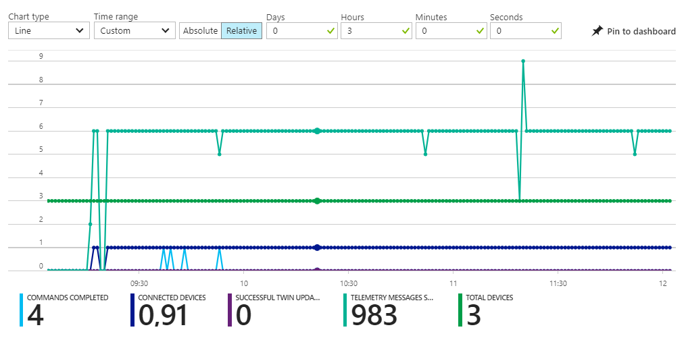

# From device to acting on insights with the Azure IoT platform 
## Operations monitoring for your IoT Platform


This is an example of how to add operations monitoring to your Microsoft Azure IoT Hub. 

We will check how devices are connected and disconnected and store these entries in blob storage.

*Note: In this workshop, we will create uniquely named Azure resources. The suggested names could be reserved already. Just try another unique name.*

### Prerequisites

1. Device (emulator) connected to the Azure IoT Hub 
2. A running Azure IoT Hub and Azure StreamAnalytics job
3. Azure account

### Objectives

In this chapter, you will learn:

1. Default monitoring for Azure IoT Hub
2. Adding operations monitoring to an IoT Hub in the Azure Portal
3. Creating an Azure Storage resource for the operations monitoring data
4. Handing Azure IoT Hub monitor data in StreamAnalytics
5. Connecting and disconnecting using your device
6. Check the arrival of the operations monitoring data in storage
7. Bonus 1: StreamAnalytics metrics monitoring
8. Bonus 2: Connecting Azure Functions to Operations Monitoring
9. Conclusion

## Default monitoring for Azure IoT Hub


Follow these steps to add monitoring to an Azure IoT Hub.

1. On the left, select `Resource groups`. A list of resource groups is shown

    

2. Select the ResourceGroup `IoTWorkshop-rg`. It will open a new blade with all resources in this group
3. Select the IoT Hub `IoTWorkshop-ih`. The IoT Hub overview is shown

    

4. You can already see how many messages are received and how many devices are registered
5. Select the category `Metrics`. You are now in the Metrics blade

    

6. In the metrics page, you will see the activity within the IoTHub for the past hours.
7. `Limit` the metrics to the last several hours:

    

Now we can see what's going on in the IoTHub. Just a few metrics are activated, you can add other metrics too. _(Note: we do not see the content of the messages)_

## Adding operations monitoring to an IoT Hub in the Azure Portal

Let's check out the monitoring of certain operations in the IoT Hub.

1. Select the category `Operations monitoring`. You are now in the Operations monitoring blade

    

2. There are multiple categories to monitor like registration of devices, ingress of messages of file uploads. We want to monitor device registration. 
3. Highlight the Monitoring category `Connections` as `Verbose`. And `Save` the selection

    

Now, every time a device is connected or disconnected, a message will be sent to the 'Event Hub-compatible endpoint'.

*Note: There are other categories to monitor too. In this workshop, we only look at Connections*

## Creating an Azure Storage resource for the operations monitoring data


Follow these steps to create dedicated Azure Storage for your operations monitoring where we can store our dedicated log.

1. Please `stop` the current device. In case of a Lora device `stop` the bridge. We will monitor the connection shortly

2. On the left, select `Resource groups`. A list of resource groups is shown

    

3. Select the ResourceGroup `IoTWorkshop-rg`. It will open a new blade with all resources in this group
4. Select `Add`. A list of available services appears

    

5. Filter it with `Storage account` and select `Storage account` (from category Storage)

    

6. An introduction will be shown. Select `Create`
7. Enter a unique storage account name eg. `iotworkshopmonstorage`. A green sign will be shown if the name is unique *Note: storage account names are written in lower case*

    

8. Select Create and the portal will start creating the storage account. Once it is created, a notification is shown

This storage account will be used to store the actual operations monitoring data, coming from the StreamAnalytics job. 

## Handing Azure IoT Hub monitor data in StreamAnalytics


    
Follow these steps to start monitoring operation using an Azure StreamAnalytics job.

*Note: if you already have a StreamAnalytics job running, you have to stop it now.*

1. On the left, select `Resource groups`. A list of resource groups is shown

    

2. Select the ResourceGroup `IoTWorkshop-rg`. It will open a new blade with all resources in this group
3. Select the Azure Stream Analytics job eg. `IoTWorkshop-sa`. At this moment there should be an Input source and Output sink already, from previous workshops.
4. Stop the Azure Stream Analytics job for now if not done already (Otherwise we cannot alter the job) _(Note: we have to wait until the job is stopped)_
5. Select `Inputs`
6. Select `Add`. A dialog to add a new input is shown

    

7. Enter `hubmoninput` as Input alias
8. Select IoT Hub as Source. Because we have only one IoT Hub in our account, all other fields are automatically filled in with the right IoT Hub, 'IoTWorkshop-ih'
9. Make one other change: alter the Endpoint to `Operations monitoring` 

    

10. Select `Create`
11. The input will be created and the connection to the hub is tested automatically. 
12. Select `Outputs`
13. Select `Add`. A dialog to add a new output is shown

    

14. Enter `hubmonbloboutput` as Output alias
15. Select `Blob storage` as Sink and the storage account is automatically selected
16. Enter as container name `hubmon` so the operation monitoring data is stored in a separate container
17. Enter `{date}/{time}` as path pattern. *Note: this will accumulate all data within the same hour in the same directory and file \yyyy\mm\dd\hh*

    

18. Select `Create`
19. The Output will be created and the connection to the hub is tested automatically. 
20. The input and output are now defined. Let's add the Azure Stream Analytics job query.
21. Select `Query`
22. The query blade is shown. Here you can write your SQL-like Azure Stream Analytics job query. *Note: we will add an extra query*
23. `Add` the following, very simple, query to the query already written 

    

    ```SQL
    SELECT
        *
    INTO
        hubmonbloboutput
    FROM 
        hubmoninput
    ```

24. There are now two queries in the same job. Press `Save`. Confirm if needed

    

25. Close the Query blade with the `close icon` or select `IoTWorkshop-sa` in the bread-crumbs in the top of the page

    

26. Now the Azure Stream Analytics job has both inputs, outputs and a query

    

27. Select `Start` 

    

28. An Azure Stream Analytics job can start with telemetry from the past (if you want to rerun historical telemetry still stored in the input) or you can start with new telemetry. Select `Now` 

    *Note: if you already had a StreamAnalytics job running, you have will have the extra option so you can go further from where you stopped the job. This way you do not loose any telemetry.*

    

29. Select `Start`
30. Starting a StreamAnalytics job takes some time (a few minutes). We have to wait for it. Check the status of the StreamAnalytics job being 'Running'.

   

The streamAnalytics job is now listening for messages about connecting and disconnecting devices. Let's check this out.

## Connecting and disconnecting using your device


Follow these steps to add monitoring to an Azure IoT Hub.

1. `Start` your emulator so it sends data.
2. In case of a LORA device, `Start` the bridge first.

This is enough to connect to the IoT Hub and disconnect again (when shutting it down again). Let's check if this operation is monitored

## Check the arrival of the operations monitoring data in storage


Follow these steps to check operation monitoring coming from an Azure IoT Hub.

1. On the left, select `Resource groups`. A list of resource groups is shown

    

2. Select the ResourceGroup `IoTWorkshop-rg`. It will open a new blade with all resources in this group
3. Select the Azure Storage Account eg. `iotworkshopmonstorage`. The storage account blade will be shown
4. A storage account has four services. Open the `Blobs` service by clicking the icon

    

5. As expected, the storage container 'hubmon' is shown

    

6. `Select` this container, a new blade is shown, containing the folder structure of the blob storage. `Drill down` into this structure to find a file at the lowest level

    

7. This path represents the date and time. The file represents all monitoring data from the same hour
8. `Select` the file to see more details. You can only look at the data by downloading it. 
9. `Download` the data

    

10. In your browser, the file will be downloaded. the name is a GUID with '.json' as the extension

   ```json
   {"protocol":"Amqp","authType":"{\"scope\":\"device\",\"type\":\"sas\",\"issuer\":\"iothub\",\"acceptingIpFilterRule\":null}","time":"2017-09-27T12:11:56.7184728Z","operationName":"**deviceConnect**","category":"Connections","level":"Information","deviceId":"IoTDevice42","ipAddress":"88.159.202.XXX"}
   {"protocol":"Amqp","time":"2017-09-27T12:15:18.6506102Z","operationName":"**deviceDisconnect**","category":"Connections","level":"Information","deviceId":"IoTDevice42","ipAddress":"88.159.202.XXX"}
   {"protocol":"Amqp","authType":"{\"scope\":\"device\",\"type\":\"sas\",\"issuer\":\"iothub\",\"acceptingIpFilterRule\":null}","time":"2017-09-27T12:19:16.2676792Z","operationName":"**deviceConnect**","category":"Connections","level":"Information","deviceId":"IoTDevice42","ipAddress":"88.159.202.XXX"}
   ```

The device connection and disconnection are stored (We see a 'connect', 'disconnect' and 'connect' again). 

*Note: depending on the device and connection which is used, it's possible that for every time some telemetry is received, the connection is opened and closed*

The monitoring categories in detail:

1. Device identity registry operations (Log events related to operations on the device identity registry)
2. Device-to-cloud messages communications (Log events related to device-to-cloud messages)
3. Cloud-to-device messages communications (Log events related to cloud-to-device messages)
4. Device connects or disconnect connections (Log events when a device connects or disconnects from the IoT hub)
5. File upload errors (Log errors related to file upload functionality at the IoT Hub level. Please note that this category cannot catch errors which directly occur while the device is uploading a file to storage)
6. Message routing (Log events related to message routing)

## Bonus 1: StreamAnalytics metrics monitoring

Follow these steps to add metrics monitoring to your StreamAnalytics job.

1. On the left, select `Resource groups`. A list of resource groups is shown

    

2. Select the ResourceGroup `IoTWorkshop-rg`. It will open a new blade with all resources in this group
3. Select the Azure Stream Analytics job eg. `IoTWorkshop-sa`
4. Just below the inputs/query/outputs panel, look at the monitoring panel, it will look a bit like this

    

5. We see multiple input events but only a few output events. _(Note: we do not know which output sink was referred too)_
6. `Click` on the panel, a separate Metrics panel is opened

    

7. Select `Edit chart`

    

8. A list of possible metrics is shown. Although custom functions (for Azure Stream Analytics) are out of scope in this workshop, here we can see the usage if applied _(note: it's possible to add custom JavaScript in your Stream Analytics job and you can reference already available Machine Learning endpoints)_

    

## Bonus 2: Connecting Azure Functions to Operations Monitoring

As seen above, the Operations monitoring event stream is represented as an Event Hub. 

Recently, in Azure Functions, the Event Hub trigger can be connected to the IoT Hub Default Event stream and also to Operations monitoring


But be aware, if you want to read the same (Operations Monitoring) messages in both the Azure Function and the Stream Analytics job, these messages have to be 'duplicated'. Every 'listener' has to be connected to another 'Consumer group'.

Both EventHubs and IoTHubs provide 'consumer groups' so a message can be read by multiple services but every service sees the message only once!

So, specify multiple consumer groups in the Operations Monitoring pane of the IoT Hub.


And check out the input fields regarding the consumers group when defining the input source for Stream Analytics and Azure Function.


If no extra consumer group is specified, all services refer to the standard available '$Default' consumer group. So, collisions will occur!

## Conclusion

This concludes this chapter of the workshop. You have both experienced how to monitor the IoT Hub and StreamAnalytics.

Thank you for checking out IoT Hub operations monitoring.

 