# The Things Network & Azure IoT: a perfect combination
## Operations monitoring for your IoT Platform


This is an example of how to add operations monitoring to your Microsoft Azure IoT Hub. We will check how many connections are made etc.

*Note: In this workshop, we will create uniquely named Azure resources. The suggested names could be reserved already. Just try another unique name.*

### Prerequisites

1. One (or more) devices running and connecting to the Azure IoT Hub using [TTN Node](TheThingsNetwork.md) or [UWP App](UwpToIotHub.md)
2. A running Azure IoT Hub using [TTN Node](TheThingsNetwork.md) or [UWP App](UwpToIotHub.md) and Azure [StreamAnalytics job](Azure.md)
3. Azure account create here (Azure passes will be present for those who have no Azure account)

### Objectives

In this workshop, you will learn:

1. Adding operations monitoring to an IoT Hub in the Azure Portal
2. Creating an Azure Storage resource for the operations monitoring data
3. Handing Azure IoT Hub monitor data in StreamAnalytics
4. Connecting and disconnecting using your device
5. Check the arrival of the operations monitoring data
6. Bonus: StreamAnalytics metrics monitoring

## Adding operations monitoring to an IoT Hub in the Azure Portal


Follow these steps to add monitoring to an Azure IoT Hub.

1. On the left, select `Resource groups`. A list of resource groups is shown

    
    
2. Select the ResourceGroup `IoTWorkshop-rg`. It will open a new blade with all resources in this group
3. Select the IoT Hub `IoTWorkshop-ih`. The IoT Hub is shown

    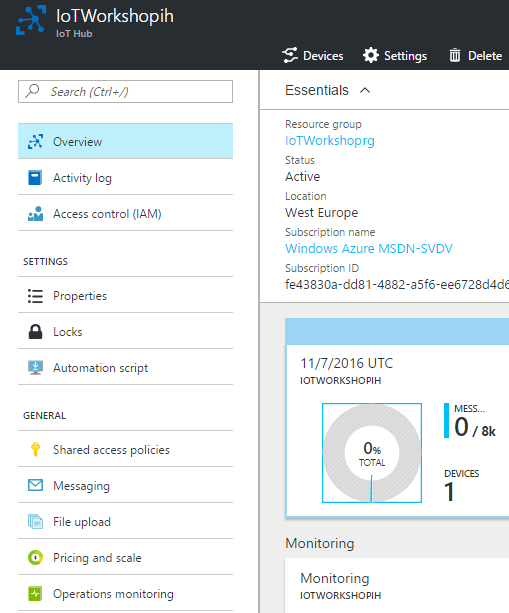

4. Select the category `Operations monitoring`. You are now in the Operations monitoring blade. 

    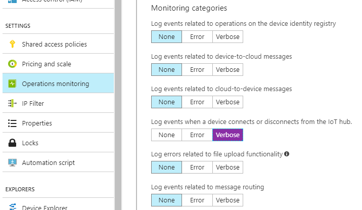

5. Highlight the Monitoring category `Connections` as `Verbose`. And `Save` the selection

    

Now, every time a device is connected or disconnected, a message will be sent to the 'Event Hub-compatible endpoint'.
 
*Note: There are other categories to monitor too. In this workshop, we only look at Connections*

*Note: The endpoint is not really an Event Hub, therefore it can not be monitored using an Azure Function for now*

## Creating an Azure Storage resource for the operations monitoring data

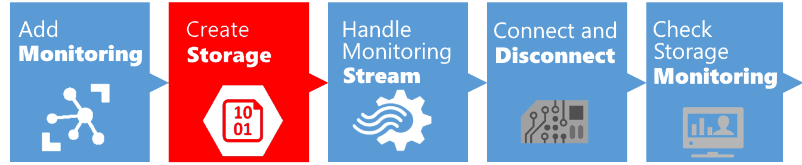

Follow these steps to create dedicated Azure Storage for your operations monitoring.

1. On the left, select `Resource groups`. A list of resource groups is shown

    

2. Select the ResourceGroup `IoTWorkshop-rg`. It will open a new blade with all resources in this group
3. Select `Add`. A list of available services appears

    

4. Filter it with `Storage account` and select `Storage account` (from category Storage)

    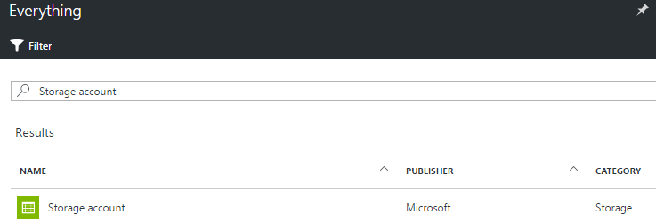

5. An introduction will be shown. Select `Create`
6. Enter a unique storage account name eg. `iotworkshopmonstorage`. A green sign will be shown if the name is unique *Note: storage account names are written in lower case*

    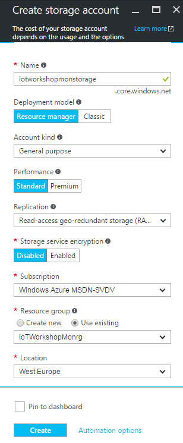

7. Select Create and the portal will start creating the storage account. Once it is created, a notification is shown

This storage account will be used to store the actual operations monitoring data, coming from the StreamAnalytics job. 

# Handing Azure IoT Hub monitor data in StreamAnalytics


Follow these steps to start monitoring operation using an Azure StreamAnalytics job.

*Note: if you already have a StreamAnalytics job running, you have to stop it now.*

1. On the left, select `Resource groups`. A list of resource groups is shown

    
    
2. Select the ResourceGroup `IoTWorkshop-rg`. It will open a new blade with all resources in this group
3. Select the Azure Stream Analytics job eg. `IoTWorkshop-sa`. At this moment there should be an Input source and Output sink already, from previous workshops.
4. Select `Inputs`
5. Select `Add`. A dialog to add a new input is shown

    

6. Enter `hubmoninput` as Input alias
7. Select IoT Hub as Source. Because we have only one IoT Hub in our account, all other fields are automatically filled in with the right IoT Hub, 'IoTWorkshop-ih'
8. Make one other change: alter the Endpoint to `Operations monitoring` 

    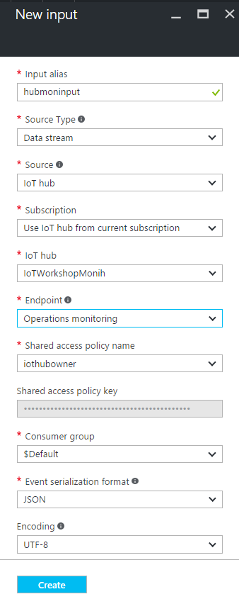

9. Select `Create`
10. The input will be created and the connection to the hub is tested automatically. 
11. Select `Outputs`
12. Select `Add`. A dialog to add a new output is shown

    

13. Enter `hubmonbloboutput` as Output alias
14. Select `Blob storage` as Sink and the storage account is automatically selected
15. Enter as container name `hubmon` so the operation monitoring data is stored in a separate container
16. Enter `{date}/{time}` as path pattern. *Note: this will accumulate all data within the same hour in the same directory and file \yyyy\mm\dd\hh*

    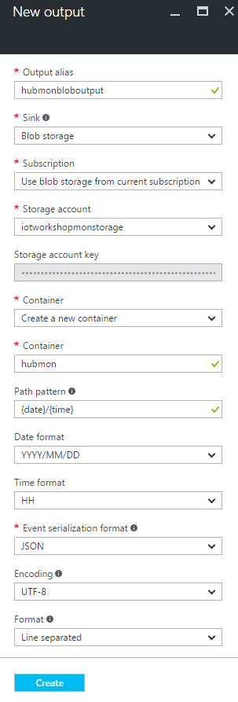

17. Select `Create`
18. The Output will be created and the connection to the hub is tested automatically. 

The input and output are now defined. Let's add the Azure Stream Analytics job query.

1. Select `Query`
2. The query blade is shown. Here you can write your SQL-like Azure Stream Analytics job query. *Note: we will add an extra query*
3. `Add` the following, very simple, query

    

4. Press `Save`. Confirm if needed

    

5. Close the Query blade with the `close icon` or select `IoTWorkshop-sa` in the bread-crumbs in the top of the page

    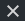

6. Now the Azure Stream Analytics job has both inputs, outputs and a query

    

7. Select `Start` 

    

8. An Azure Stream Analytics job can start with telemetry from the past (if you want to rerun historical telemetry still stored in the input) or you can start with new telemetry. Select `Now` 

    *Note: if you already had a StreamAnalytics job running, you have will have the extra option so you can go further from where you stopped the job. This way you do not loose any telemetry.*

    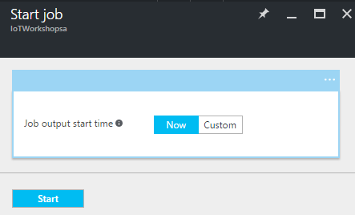

9. Select `Start`
10. Starting a StreamAnalytics job takes some time (a few minutes). We have to wait for it. Check the status of the StreamAnalytics job being 'Running'.

    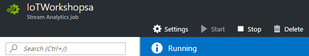

The streamAnalytics job is now listening for messages about connecting and disconnecting devices. Let's check this out.

## Connecting and disconnecting using your device


Follow these steps to add monitoring to an Azure IoT Hub.

*Note: In this workshop, the UWP app is used to show how a connection is made. An actual device will do the same*

1. `Start` your UWP app or device
2. `Send` telemetry. Repeat this several times
3. `Close` the app or stop the device

This is enough to connect to the IoT Hub. Let's check if this operation is monitored

# Check the arrival of the operations monitoring data

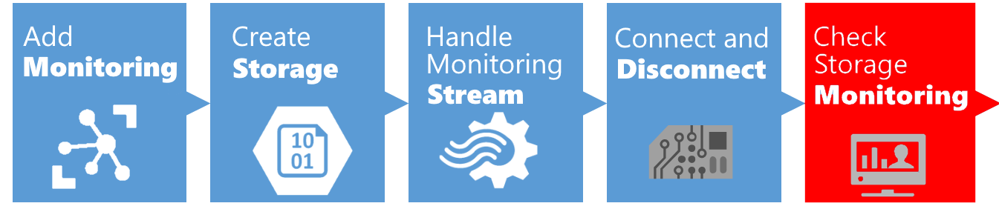

Follow these steps to check operation monitoring coming from an Azure IoT Hub.

1. On the left, select `Resource groups`. A list of resource groups is shown

    
    
2. Select the ResourceGroup `IoTWorkshop-rg`. It will open a new blade with all resources in this group
3. Select the Azure Storage Account eg. `iotworkshopmonstorage`. The storage account blade will be shown
4. A storage account has four services. Open the `Blobs` service by clicking the icon

    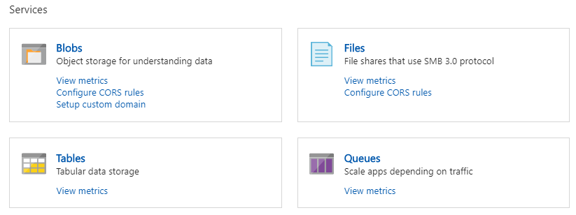

5. As expected, the storage container 'hubmon' is shown

    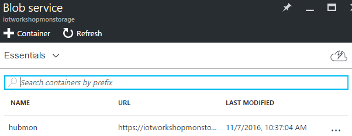

6. `Select` this container, a new blade is shown, containing the folder structure of the blob storage. `Drill down` into this structure to find a file at the lowest level

    

7. This path represents the date and time. The file represents all monitoring data from the same hour
8. `Select` the file to see more details. You can only look at the data by downloading it. 
9. `Download` the data

    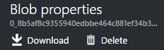

10. in your browser, the file will be downloaded. the name is a GUID with .json as the extension

    ```json
    {"protocol":"Amqp","authType":"{ \"scope\": \"device\", \"type\": \"sas\", \"issuer\": \"iothub\" }","time":"2016-11-07T22:10:28.5889858Z","operationName":"deviceConnect","category":"Connections","level":"Information","deviceId":"DummyDevice"}
    {"protocol":"Amqp","authType":"{ \"scope\": \"device\", \"type\": \"sas\", \"issuer\": \"iothub\" }","time":"2016-11-07T22:10:31.6272662Z","operationName":"deviceConnect","category":"Connections","level":"Information","deviceId":"DummyDevice"}
    {"protocol":"Amqp","time":"2016-11-07T22:10:43.1931939Z","operationName":"deviceDisconnect","category":"Connections","level":"Information","deviceId":"DummyDevice"}
    {"protocol":"Amqp","time":"2016-11-07T22:10:41.2938878Z","operationName":"deviceDisconnect","category":"Connections","level":"Information","deviceId":"DummyDevice"}
    ```

The device connection and disconnection are stored.

*Note: Perhaps you will notice that, although you only started the Device app once, you get multiple connect/disconnect messages. This is a shortcoming of the app, not the Azure IoT Hub. The extension 'connected service for Azure IoT Hub' makes stateless connections to the IoT Hub, thus connecting and disconnecting for every telemetry message sent*

The monitoring categories in detail:

1. Device identity operations (Log events related to operations on the device identity registry)
2. Device-to-cloud communications (Log events related to device-to-cloud messages)
3. Cloud-to-device communications ()
4. Connections (Log events when a device connects or disconnects from the IoT hub)
5. File uploads (Log errors related to file upload functionality at the IoT Hub level. Please note that this category cannot catch errors which directly occur while the device is uploading a file to storage)

# Bonus: StreamAnalytics metrics monitoring

Follow these steps to add metrics monitoring to your StreamAnalytics job.

1. On the left, select `Resource groups`. A list of resource groups is shown

    
    
2. Select the ResourceGroup `IoTWorkshop-rg`. It will open a new blade with all resources in this group
3. Select the Azure Stream Analytics job eg. `IoTWorkshop-sa`
4. Just below the inputs/query/outputs panel, look at the monitoring panel. No data is available

    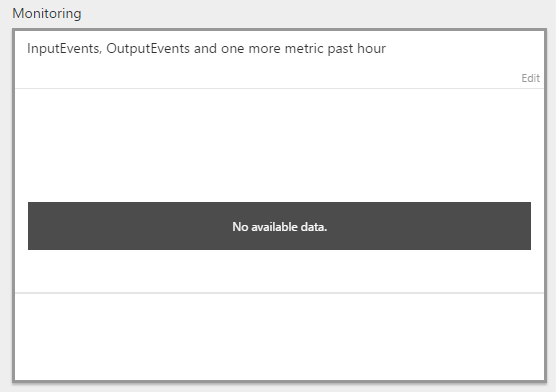

5. This is because the monitoring settings are not set yet
6. `Click` on the panel, a separate Metrics panel is opened

    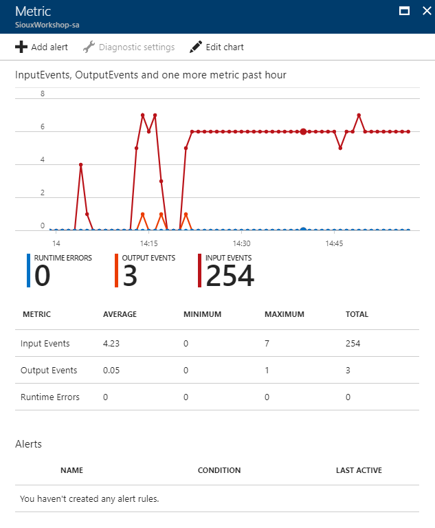

7. `Select` diagnostics settings

    

8. The storage account selected, has to be updated. `Select` the account you just created eg. 'iotworkshopmonstorage'
9. `Save` this settings change and return back to the StreamAnalytics page. Pass some telemetry and wait. This could take several minutes. The events will become visible 

    

This concludes this chapter of the workshop. You have both experienced how to monitor the IoT Hub and StreamAnalytics.

Thank you for checking out IoT Hub operations monitoring.


