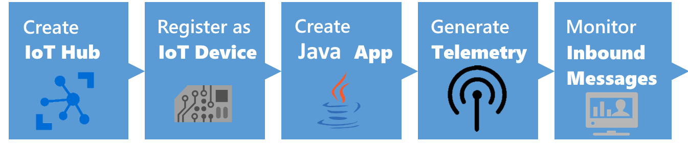
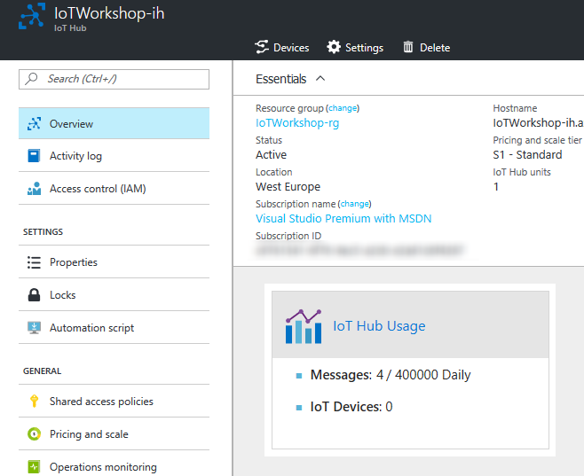
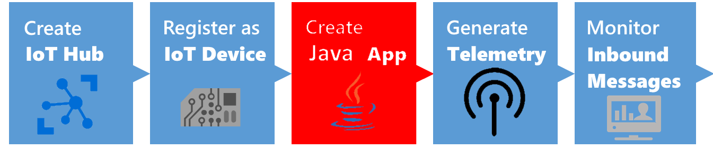
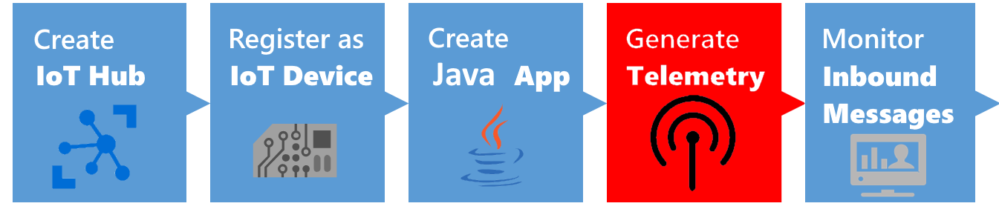
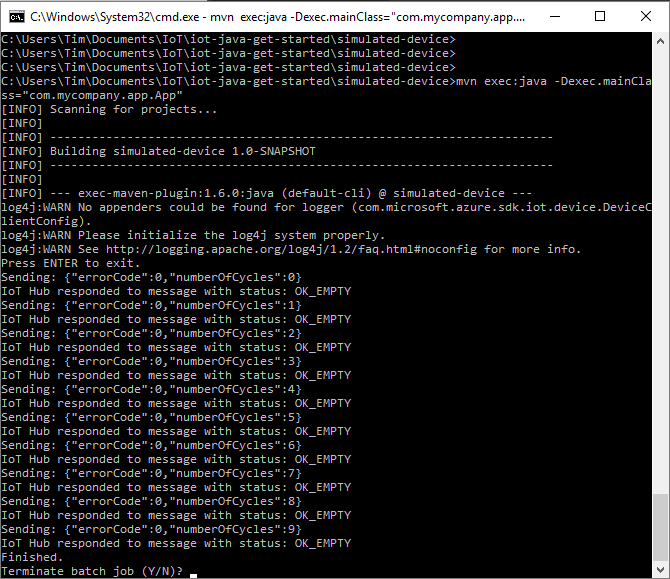

# From device to acting on insights with the Azure IoT platform 
## Connecting to an IoT Hub using a java app device simulation



This is an example integration between a Java app and Azure IoT Hub. This integration shows features like creating devices in the Azure IoT Hub device registry as well as sending telemetry to the IoT Hub.

*Note: In this workshop, we will create uniquely named Azure resources. The suggested names could be reserved already. Just try another unique name.*

*Note: The IoT Hub also offers the ability to send commands back to devices. This is not part of this workshop.*

### Prerequisites

1. A Windows 7+ or Linux or Mac computer with internet access
2. [JDK 8](http://www.oracle.com/technetwork/java/javase/downloads/jdk8-downloads-2133151.html). Install instructions [here](https://github.com/Azure/azure-iot-sdk-java/blob/master/doc/java-devbox-setup.md#installjava).
3. [Maven software project management](https://maven.apache.org/download.cgi) _(Maven 3 is recommended)_. Install instructions [here](https://github.com/Azure/azure-iot-sdk-java/blob/master/doc/java-devbox-setup.md#installmaven).
4. [Node.js](https://nodejs.org/en/). _(We prefer Version 6)_
5. Azure account [create here](https://azure.microsoft.com/en-us/free/) _([Azure passes](https://www.microsoftazurepass.com/howto) will be present for those who have no Azure account (please check your email for final confirmation))_
6. [IoT Hub Explorer](https://www.npmjs.com/package/iothub-explorer) _(for Command-Line interface based usage; see below for installation steps)_


### Objectives

In this workshop, you will learn:

1. Creating an IoT Hub in the Azure Portal
2. Creating a new Java app
3. Connect to the IoT Hub by registering the app like a device
4. Generate and send dummy telemetry
5. Check the arrival of the telemetry

## Creating an Azure IoT Hub in the Azure portal


Follow these steps to create an Azure IoT Hub.

1. Log into the [Azure portal](https://portal.azure.com/). You will be asked to provide Azure credentials if needed
2. On the left, a number of common Azure services are shown. Select `More Services` to open a list with all available services

    

3. Filter it with `IoT Hub`

    

4. Select `IoT Hub` and a new blade will be shown. Select `Add` and you will be asked to enter the information needed to create an IoT Hub

    

5. Enter a unique IoT Hub name eg. `IoTWorkshop-ih`. A green sign will be shown if the name is unique
6. Enter a unique Resource Group eg. `IoTWorkshop-rg`. A green sign will be shown if the name is unique
7. Select `West Europe` for the location, if needed

    

8. Press `Create` and the portal will start creating the service. Once it is created, a notification is shown. In the right upper corner, a bell represents the list of all notifications shown

    

Creating an IoT Hub takes some time. Meanwhile, we will start with the app which will connect to the IoT Hub later on.


## Connect to the IoT Hub and register the app like a device


Unlike event hubs, all devices that use an IoT hub must be individually registered, and use their own endpoint and shared access key to access the hub. In this exercise, you will register a client device.

### Get the Hostname and Connection String for the Hub

To register a client device, you must run a script that uses a connection with sufficient permissions to access the hub registry. In this case, you will use the built-in iothubowner shared access policy to accomplish this.

1. Check the Azure portal. The resource group and the IoT Hub should be created by now (otherwise, we were unable to send duty cycles information to it)

    

2. On the left, select `Resource groups`. A list of resource groups is shown

    

3. Select the resource group `IoTWorkshop-rg`. It will open a new blade with all resources in this group
4. Select the IoT Hub `IoTWorkshop-ih`. It will open a new blade with the IoT Hub

    

5. The IoTHub has not received any messages yet. Check the general settings for `Shared access policies`

    

6. Navigate to the 'iothubowner' policy and **write down** this `Connection String-Primary Key`

    

This is the secret from the IoT Hub, needed to connect our Java client and monitor it later on

*Note: For more information about access control for IoT hubs, see [Access control](https://azure.microsoft.com/en-us/documentation/articles/iot-hub-devguide-security/) in the "Azure IoT Hub developer guide."*


### Create a Device Identity

Each device that sends data to the IoT hub must be registered with a unique identity.

1. `Create` a new _create-device-identity_ folder on your system.
2. Use the following `Command` at your command prompt:

	```console
	mvn archetype:generate -DgroupId=com.mycompany.app -DartifactId=create-device-identity -DarchetypeArtifactId=maven-archetype-quickstart -DinteractiveMode=false
	```

3. A maven project is created with a pom.xml file
4. `Navigate` to _create-device-identity_ folder
5. Using a text editor, open the pom.xml file in the _create-device-identity_ folder and `add` the following dependency to the dependencies node. This dependency enables you to use the iot-service-client package in your app:

	```xml
	<dependency>
	   <groupId>com.microsoft.azure.sdk.iot</groupId>
	   <artifactId>iot-service-client</artifactId>
	   <version>1.2.17</version>
	</dependency>
	```

6. `Save` and close the pom.xml file.
7. Using a text editor, `open` the create-device-identity\src\main\java\com\mycompany\app\App.java file.
8. `Add` the following import statements to the file:

	```java
	import com.microsoft.azure.sdk.iot.service.exceptions.IotHubException;
	import com.microsoft.azure.sdk.iot.service.Device;
	import com.microsoft.azure.sdk.iot.service.RegistryManager;

	import java.io.IOException;
	import java.net.URISyntaxException;
	```

9. `Add` the following class-level variables to the App class, replacing {yourhubconnectionstring} with the value your noted earlier:

	```java
	private static final String connectionString = "{yourhubconnectionstring}";
	private static final String deviceId = "MachineCyclesJava";
	```

10. `Modify` the signature of the main method to include the exceptions as follows:

	```java
	public static void main( String[] args ) throws IOException, URISyntaxException, Exception
	```

11. `Add` the following code as the body of the main method. This code creates a device called javadevice in your IoT Hub identity registry if it doesn't already exist. It then displays the device ID and key that you need later:

	```java
	RegistryManager registryManager = RegistryManager.createFromConnectionString(connectionString);

	Device device = Device.createFromId(deviceId, null, null);
	try {
	  device = registryManager.addDevice(device);
	} catch (IotHubException iote) {
	  try {
	    device = registryManager.getDevice(deviceId);
	  } catch (IotHubException iotf) {
	    iotf.printStackTrace();
	  }
	}
	System.out.println("Device ID: " + device.getDeviceId());
	System.out.println("Device key: " + device.getPrimaryKey());
	```

12. `Save` and `close` the App.java file.
13. To `build` the _create-device-identity_ app using Maven, execute the following command at the command prompt in the create-device-identity folder:

	```console
	mvn clean package -DskipTests
	```

14. To `run` the create-device-identity app using Maven, execute the following command at the command prompt in the create-device-identity folder:

	```console
	mvn exec:java -Dexec.mainClass="com.mycompany.app.App"
	```

15. Make a `note` of the Device ID and Device key. You need these values later when you create an app that connects to IoT Hub as a device.

We have created a registration for a device simulation. Now let's build the actual device simulation.

## Creating a new Java App



Now that you have registered a client device, you can create an application that the device can use to submit data to the IoT Hub.

### Create a Java Device Application
Now that you have registered a device, let's create the device which can submit data to the IoT hub.

1. `Create` a Maven project called _simulated-device_ using the following command at your command prompt:

	```console
	mvn archetype:generate -DgroupId=com.mycompany.app -DartifactId=simulated-device -DarchetypeArtifactId=maven-archetype-quickstart -DinteractiveMode=false
	```

2. At your command prompt, `navigate` to the _simulated-device_ folder.
3. Using a text editor, open the pom.xml file in the simulated-device folder and `add` the following dependencies to the dependencies node. This dependency enables you to use the iothub-java-client package in your app to communicate with your IoT hub and to serialize Java objects to JSON:

	```xml
	<dependency>
	  <groupId>com.microsoft.azure.sdk.iot</groupId>
	  <artifactId>iot-device-client</artifactId>
	  <version>1.1.23</version>
	</dependency>
	<dependency>
	  <groupId>com.google.code.gson</groupId>
	  <artifactId>gson</artifactId>
	  <version>2.3.1</version>
	</dependency>
	```

4. `Save` and close the pom.xml file.
5. Using a text editor, `open` the simulated-device\src\main\java\com\mycompany\app\App.java file.
6. `Add` the following import statements to the file:

	```java
	import com.microsoft.azure.sdk.iot.device.DeviceClient;
	import com.microsoft.azure.sdk.iot.device.IotHubClientProtocol;
	import com.microsoft.azure.sdk.iot.device.Message;
	import com.microsoft.azure.sdk.iot.device.IotHubStatusCode;
	import com.microsoft.azure.sdk.iot.device.IotHubEventCallback;
	import com.microsoft.azure.sdk.iot.device.MessageCallback;
	import com.microsoft.azure.sdk.iot.device.IotHubMessageResult;
	import com.google.gson.Gson;

	import java.io.IOException;
	import java.net.URISyntaxException;
	import java.util.Random;
	import java.util.concurrent.Executors;
	import java.util.concurrent.ExecutorService;
	```

7. `Add` the following class-level variables to the App class. Replacing {youriothubname} with your IoT hub name, and {yourdevicekey} with the device key value you generated in the create a device identity section:

	```java
	private static String connString = "HostName={youriothubname}.azure-devices.net;DeviceId=MachineCyclesJava;SharedAccessKey={yourdevicekey}";
	private static IotHubClientProtocol protocol = IotHubClientProtocol.MQTT;
	private static String deviceId = "MachineCyclesJava";
	private static DeviceClient client;
	private static Integer numberOfCycles = 0;
	private static Integer errorCode = 0;
	```

8. `Add` the following nested **AppMessageCallback** class to the App class. This class makes it possible to receive & handle messages sent from iothub: 

	```java
	private static class AppMessageCallback implements MessageCallback {
		public IotHubMessageResult execute(Message msg, Object context) {
			System.out.println("Received message from hub: "
				+ new String(msg.getBytes(), Message.DEFAULT_IOTHUB_MESSAGE_CHARSET));

			System.out.println("Message[0]");
			System.out.println(msg.getBytes()[0]);

			if(msg.getBytes()[0] >= 42) {
				errorCode = 0;
			}

			return IotHubMessageResult.COMPLETE;
		}
	}	
	```

9. `Add` the following nested **TelemetryDataPoint** class inside the App class to specify the telemetry data your device sends to your IoT hub:: 

	```java
	private static class TelemetryDataPoint {
		public Integer errorCode;
		public Integer numberOfCycles;

		public String serialize() {
			Gson gson = new Gson();
			return gson.toJson(this);
		}
	}
	```

10. `Add` the following nested **EventCallback** class inside the App class to display the acknowledgement status that the IoT hub returns when it processes a message from the simulated device app. This method also notifies the main thread in the app when the message has been processed:: 

	```java
	private static class EventCallback implements IotHubEventCallback
	{
		public void execute(IotHubStatusCode status, Object context) {
			System.out.println("IoT Hub responded to message with status: " + status.name());

			if (context != null) {
				synchronized (context) {
					context.notify();
				}
			}
		}
	}
	```

11. `Add` the following nested **MessageSender** class inside the App class. The run method in this class generates sample telemetry data to send to your IoT hub and waits for an acknowledgement before sending the next message:

	```java
	private static class MessageSender implements Runnable {
		public void run()  {
			try {
				while (true) {
					TelemetryDataPoint telemetryDataPoint = new TelemetryDataPoint();
					telemetryDataPoint.errorCode = errorCode;
					telemetryDataPoint.numberOfCycles = numberOfCycles;

					String msgStr = telemetryDataPoint.serialize();
					Message msg = new Message(msgStr);
					System.out.println("Sending: " + msgStr);

					Object lockobj = new Object();
					EventCallback callback = new EventCallback();
					client.sendEventAsync(msg, callback, lockobj);

					synchronized (lockobj) {
						lockobj.wait();
					}

					if(errorCode == 0) {
						numberOfCycles++;
					}
					if(numberOfCycles != 0 && numberOfCycles % 3 == 0) {
						errorCode = 1;
					}

					Thread.sleep(2000);
				}
			} catch (InterruptedException e) {
				System.out.println("Finished.");
			}
		}
	}
	```

12. `Replace` the **main** method with the following code that creates a thread to send device-to-cloud messages to your IoT hub:

	```java
	public static void main( String[] args ) throws IOException, URISyntaxException {
		client = new DeviceClient(connString, protocol);

		MessageCallback callback = new AppMessageCallback();
		client.setMessageCallback(callback, null);
		client.open();

		MessageSender sender = new MessageSender();

		ExecutorService executor = Executors.newFixedThreadPool(1);
		executor.execute(sender);

		System.out.println("Press ENTER to exit.");
		System.in.read();
		executor.shutdownNow();
		client.close();
	}
	```

13. `Save` and close the App.java file.
14. To `build` the simulated-device app using Maven, execute the following command at the command prompt in the simulated-device folder:

	```console 
	mvn clean package -DskipTests
	```

The simulation of a machine is now written. You are ready to send telemetry.

## Generate and send dummy telemetry



Now you can run the java application to send data to the IoT hub.

1. To run the application, execute the following command at the command prompt in the simulated-device folder:

	```console
	mvn exec:java -Dexec.mainClass="com.mycompany.app.App"
	```

2. `Observe` the script running as it starts to submit device readings.

    

Now we have sent telemetry to the IoT Hub. Let's check if it's arrived.

## Monitoring the arrival of the telemetry in Azure


We can monitor the arrival of telemetry only if we have enough rights to look into the IoT Hub. We collected the IoT Hub Policy secrets already.

### IoT Hub Explorer

We can check the arrival of messages in the Azure IoT Hub. This can be done using a Command-Line tool named IoT Hub Explorer (node package).

### Install & run

We can check the arrival of the messages in the Azure IoT Hub using the IoT Hub Explorer. This tool is Command-Line based, please check the installation requirements. 

*Note : See the [full example](https://www.npmjs.com/package/iothub-explorer) for more options of this tool.*

1. Create a new folder eg. `c:\iothubexplorer`
2. In a dos-box (press Windows button-R, type CMD and enter), navigate to the new folder `c:\iothubexplorer`
3. In this folder, run the following command `npm install -g iothub-explorer@latest` in your command-line environment, to install the latest (pre-release) version of the iothub-explorer tool
4. Login to the IoT Hub Explorer by supplying your *remembered* IoT Hub `Connection String-primary key` using the command `iothub-explorer login "[your connection string]"`
5. A session with the IoT Hub will start and it will last for approx. one hour:

    ```
    Session started, expires on Thu Jan 05 2017 22:53:55 GMT+0100 (W. Europe Standard Time)
    ```

6. To monitor the device-to-cloud messages from a device, use the following command `iothub-explorer monitor-events --login [your connection string]` and `fill in` your *remembered* IoT Hub 'Connection String-primary key'
7. All devices are monitored now. This will result in the following messages

    ```
    Monitoring events from all devices...
    From: MachineCyclesNodeJs
    {
      "errorCode": 0,
      "numberOfCycles": 2
    }
    -------------------
    From: MachineCyclesNodeJs
    {
      "errorCode": 0,
      "numberOfCycles": 3
    }
    -------------------
    ```

The cycle information is arriving.

## Conclusion

These messages shown during the monitoring step are now available in Azure, and kept in the IotHub until other resources are asking for telemetry...

Next Step: You are now ready to process your data in an Azure Function. Continue to [Receiving and handling telemetry in Azure](AzureNodeJs.md)

 
