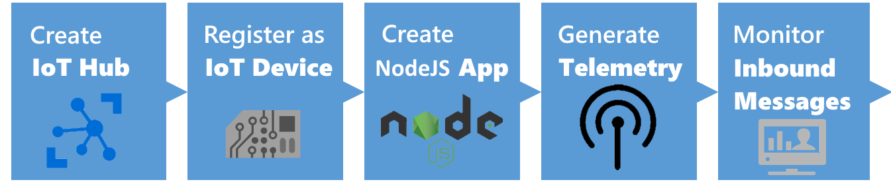
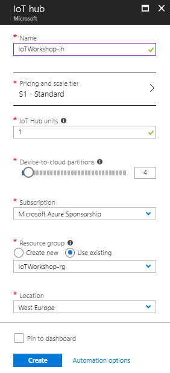
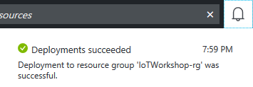
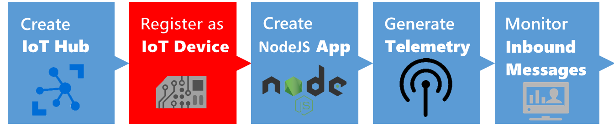
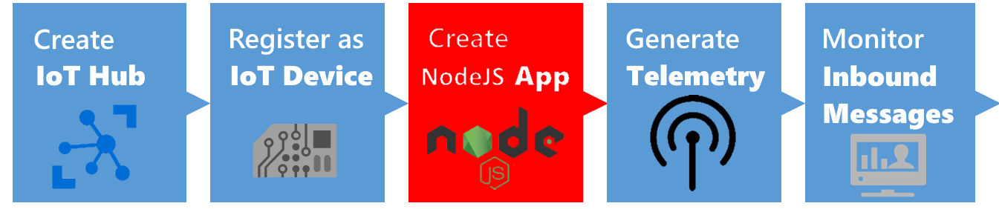
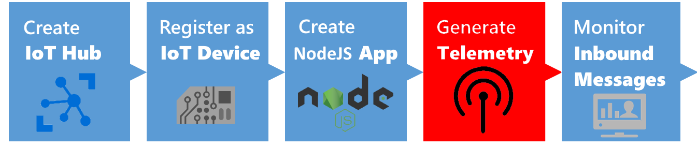
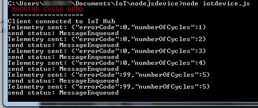
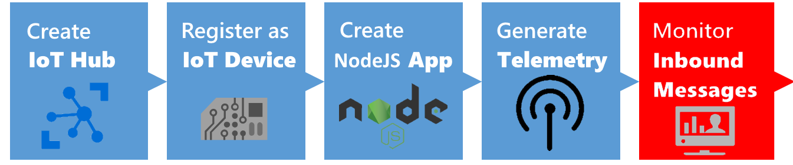

 ## Connecting to an IoT Hub using a NodeJs app device simulation



This is an example integration between a NodeJs app and Azure IoT Hub. This integration shows features like creating devices in the Azure IoT Hub device registry as well as sending telemetry to the IoT Hub.

*Note: In this workshop, we will create uniquely named Azure resources. The suggested names could be reserved already. Just try another unique name.*

*Note: The IoT Hub also offers the ability to send commands back to devices. This is not part of this workshop.*

### Prerequisites

1. A Windows 7+ or Linux or Mac computer with internet access
2. [Node.js](https://nodejs.org/en/). _(We prefer Version 6)_
3. Azure account [create here](https://azure.microsoft.com/en-us/free/) _([Azure passes](https://www.microsoftazurepass.com/howto) will be present for those who have no Azure account (please check your email for final confirmation))_
4. [IoT Hub Explorer](https://www.npmjs.com/package/iothub-explorer) _(for Command-Line interface based usage; see below for installation steps)_

### Objectives

In this workshop, you will learn:

1. Creating an IoT Hub in the Azure Portal
2. Creating a new NodeJs app
3. Connect to the IoT Hub by registering the app like a device
4. Generate and send dummy telemetry
5. Check the arrival of the telemetry

## Creating an Azure IoT Hub in the Azure portal


Follow these steps to create an Azure IoT Hub.

1. Log into the [Azure portal](https://portal.azure.com/). You will be asked to provide Azure credentials if needed
2. On the left, a number of common Azure services are shown. Select `More Services` to open a list with all available services

    

3. Filter it with `IoT Hub`

    

4. Select `IoT Hub` and a new blade will be shown. Select `Add` and you will be asked to enter the information needed to create an IoT Hub

    

5. Enter a unique IoT Hub name eg. `IoTWorkshop-ih`. A green sign will be shown if the name is unique
6. Enter a unique Resource Group eg. `IoTWorkshop-rg`. A green sign will be shown if the name is unique
7. Select `West Europe` for the location, if needed

    

8. Press `Create` and the portal will start creating the service. Once it is created, a notification is shown. In the right upper corner, a bell represents the list of all notifications shown

    

Creating an IoT Hub takes some time. Meanwhile, we will start with the app which will connect to the IoT Hub later on.


## Connect to the IoT Hub and register the app like a device



Unlike event hubs, all devices that use an IoT hub must be individually registered, and use their own endpoint and shared access key to access the hub. In this exercise, you will register a client device.

### Get the Hostname and Connection String for the Hub

To register a client device, you must run a script that uses a connection with sufficient permissions to access the hub registry. In this case, you will use the built-in iothubowner shared access policy to accomplish this.

1. Check the Azure portal. The resource group and the IoT Hub should be created by now (otherwise, we were unable to send duty cycles information to it)

    

2. On the left, select `Resource groups`. A list of resource groups is shown

    

3. Select the resource group `IoTWorkshop-rg`. It will open a new blade with all resources in this group
4. Select the IoT Hub `IoTWorkshop-ih`. It will open a new blade with the IoT Hub

    

5. The IoTHub has not received any messages yet. Check the general settings for `Shared access policies`

    

6. Navigate to the 'iothubowner' policy and **write down** this `Connection String-Primary Key`

    

These is the secret from the IoT Hub, needed to connect our NodeJs client and monitor it later on

*Note: For more information about access control for IoT hubs, see [Access control](https://azure.microsoft.com/en-us/documentation/articles/iot-hub-devguide-security/) in the "Azure IoT Hub developer guide."*


### Create a Device Identity

Each device that sends data to the IoT hub must be registered with a unique identity.

1. `Create` a new "createdeviceid" folder on your system.
2. `Open` a Node.JS console or dosbox and navigate to the createdeviceid folder.
3. Enter the following `command`, and press RETURN to accept all the default options. This creates a package.json file for your application:

```javascript
npm init
```

4. Enter the following `command` to install the Azure IoT Hub package:

```javascript
npm install azure-iothub
```

5. Create a `createdeviceid.js` file in the createdeviceid folder.
6. Use a text editor to `edit` the "createdeviceid.js" file.
7. Modify the file with the following script and set the `connStr variable` to reflect the shared access policy connection string for your IoT Hub, as shown here:

```javascript
'use strict';
var iothub = require('azure-iothub');
var connStr = '<IOT-HUB-CONNECTION-STRING>';
var registry = iothub.Registry.fromConnectionString(connStr);
var device = new iothubDevice(null);
device.deviceId = 'MachineCyclesNodeJs';

registry.create(device, function(err, deviceInfo, res) {
  if (err) {
    registry.get(device.deviceId, printDeviceInfo);
  }
  if (deviceInfo) {
    printDeviceInfo(err, deviceInfo, res)
  }
});

function printDeviceInfo(err, deviceInfo, res) {
  if (deviceInfo) {
    console.log('Device id: ' + deviceInfo.deviceId);
  }
}
```

8. `Save` the script and close the file.
9. In the Node.JS console window, `enter` the following command to run the script:

```javascript
node createdeviceid.js
```

10. `Verify` that the script registers a device with the ID MachineCyclesNodeJs.
11. In the Azure portal, on the blade for your IoT Hub, `click` the Overview tab. 
12. then at the top of the blade, `click` Devices and verify that MachineCyclesNodeJs is listed.
13. `Click` MachineCyclesNodeJs and view the device-specific keys and connection strings that have been generated. 
14. Then `copy` the connection string-primary key for MachineCyclesNodeJs to the clipboard. You will use this in the next exercise.

We have created a registration for a device simulation. Now let's build the actual device simulation.

## Creating a new NodeJs App



Now that you have registered a client device, you can create an application that the device can use to submit data to the IoT Hub.

### Create a Client Device Application
Now that you have registered a device, it can submit data to the IoT hub.

1. `Create` a new "iotdevice" folder on your system.
2. `Open` the Node.JS console or dosbox and navigate to the iotdevice folder.
3. Enter the following command, and press RETURN to accept all the default options. This creates a package.json file for your application:

```javascript
npm init
```

4. Enter the following command to install the Azure IoT device and AMQP protocol packages:

```javascript
npm install azure-iot-device azure-iot-device-amqp
```

5. Create an `iotdevice.js` file in the iotdevice folder.
6. Use a text editor to `edit` the "iotdevice.js" file.
7. Modify the script with the following script and set the `connStr variable` to reflect the *device connection string* for the MachineCyclesNodeJs device (which you copied to the clipboard in the previous exercise), as shown here:

```javascript
'use strict';

var clientFromConnectionString = require('azure-iot-device-amqp').clientFromConnectionString;
var Message = require('azure-iot-device').Message;
var connStr = '<DEVICE_CONNECTION_STRING>';
var client = clientFromConnectionString(connStr);

function printResultFor(op) {
  return function printResult(err, res) {
    if (err) console.log(op + ' error: ' + err.toString());
    if (res) console.log(op + ' status: ' + res.constructor.name);
  };
}

var i = 1;
var e = 0;
var repaired = false;

var connectCallback = function (err) {
  if (err) {
    console.log('Could not connect to IoT Hub: ' + err);
  } else {
    console.log('Client connected to IoT Hub');

                
    client.on('message', function (msg) {
      client.complete(msg, printResultFor('completed'));

      if ( msg.data[0] >= 42) {
        console.log("\x1b[33m",'Repair command received. Machine started running again');
        console.log("\x1b[0m", '------------------------------------------------------');      
        e = 0;
        repaired = true;
      }
    });

    // Create a message and send it to the IoT Hub every second
    setInterval(function(){
      if (i % 5 == 0 && !repaired ) {
        e = 99; 
      }
      repaired = false;

      var data = JSON.stringify({ errorCode: e, numberOfCycles: i });
      var message = new Message(data);
      console.log("Telemetry sent: " + message.getData());
      client.sendEvent(message, printResultFor('send'));

      if (e == 0) {
        i++;
      } 
    }, 10000);
  }
};

console.log("\x1b[31m",'MACHINE CYCLE DEMO');
console.log("\x1b[0m", '==================');

client.open(connectCallback);
```

8. `Save` the script and close the file.

The simulation of a machine is now written. You are ready to send telemetry.

## Generate and send dummy telemetry



Now you can run your client application to send data to the IoT hub.

1. In the Node.JS console window, enter the following `command` to run the script:

```javascript
node iotdevice.js
```

2. `Observe` the script running as it starts to submit device readings.

    

Now we have sent telemetry to the IoT Hub. Let's check if it's arrived.

## Monitoring the arrival of the telemetry in Azure



We can monitor the arrival of telemetry only if we have enough rights to look into the IoT Hub. We collected the IoT Hub Policy secrets already.

### IoT Hub Explorer

We can check the arrival of messages in the Azure IoT Hub. This can be done using a Command-Line tool named IoT Hub Explorer (node package).

### Install & run

We can check the arrival of the messages in the Azure IoT Hub using the IoT Hub Explorer. This tool is Command-Line based, please check the installation requirements. 

*Note : See the [full example](https://www.npmjs.com/package/iothub-explorer) for more options of this tool.*

1. Create a new folder eg. `c:\iothubexplorer`
2. In a dos-box (press Windows button-R, type CMD and enter), navigate to the new folder `c:\iothubexplorer`
3. In this folder, run the following command `npm install -g iothub-explorer@latest` in your command-line environment, to install the latest (pre-release) version of the iothub-explorer tool
4. Login to the IoT Hub Explorer by supplying your *remembered* IoT Hub `Connection String-primary key` using the command `iothub-explorer login "[your connection string]"`
5. A session with the IoT Hub will start and it will last for approx. one hour:

    ```
    Session started, expires on Thu Jan 05 2017 22:53:55 GMT+0100 (W. Europe Standard Time)
    ```

6. To monitor the device-to-cloud messages from a device, use the following command `iothub-explorer monitor-events --login [your connection string]` and `fill in` your *remembered* IoT Hub 'Connection String-primary key'
7. All devices are monitored now. This will result in the following messages

    ```
    Monitoring events from all devices...
    From: MachineCyclesNodeJs
    {
      "errorCode": 0,
      "numberOfCycles": 2
    }
    -------------------
    From: MachineCyclesNodeJs
    {
      "errorCode": 0,
      "numberOfCycles": 3
    }
    -------------------
    ```

The cycle information is arriving.

## Conclusion

These messages shown during the monitoring step are now available in Azure, and kept in the IotHub until other resources are asking for telemetry...

Next Step: You are now ready to process your data in an Azure Function. Continue to [Receiving and handling telemetry in Azure](AzureNodeJs.md)


