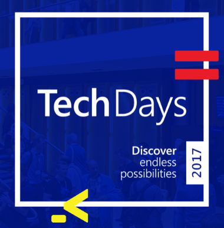
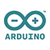

# From device to acting on insights with the Azure IoT platform 
## IoT Tech Day 2017 - IoT Hands-on Lab

The workshop will simulate a remote located machine malfunctioning and getting restarted based on the received telemetry and created insights based on the telemetry data. You will be creating all components to get the malfunctioning machine back up running again. All of that within 2 hours.
In this hands-on lab, you will be creating the complete chain from configuring, connecting a device via packet radio technology to The Things Network cloud, to bridging the gap between the TTN cloud and the Microsoft Azure IoT platform, creating actionable insights on the Microsoft Azure IoT platform and sending commands all the way back to the device. This includes assembling hardware, configuring hardware and configuring software and coding the missing logic to a complete IoT solution.

Technologies used during the hands-on lab; `Arduino development boards`, `sensors`, `The Things Network` cloud (`LoRa` & `LoraWAN`) and Microsoft Azure IoT Platform including: `Azure Web Jobs`, `Azure IoT Hub`, `Azure Stream analytics`, `Azure Event hub`, `Azure Blob storage` and Azure Functions.

This hands-on lab will be guided by Jan Willem Groenenberg & Sander van de Velde , so attendees have on site support for questions. We will also provide background information about the used components in the hands-on lab. The hands-on lab is created in conjunction with Atos who will provide most the hardware used in the hands-on lab, the rest of the hardware will be provided by Microsoft Nederland. 

**Hardware used will *remain property* of Atos and/or Microsoft.**

## Team of experts

During the workshop the following experts will be present to guide you through the workshop:

- [Jan Willem Groenenberg](http://iottechday.nl/speakers/jan-willem-groenenberg/); IoT Solution Architect   
- [Sander van de Velde](http://iottechday.nl/speakers/sander-van-de-velde/); MVP, Microsoft Consultant 
  

## Workshop schedule at IoT Tech Day 2017

| Location | Start Time |  Room  |
| -------- | ---------- | ------ |
| Utrecht, Jaarbeurs, April 19 2017 | 11.30h | Glow |

## Let's dive into the workshop

The workshop consists of several chapters. The first two chapters will guide you through the essentials we want you to get your hands on. The other chapters are optional/extra if you have time left.

1. **Connecting a device to the Azure IoT Platform**
    
    You have 4 options to choose from to start with. You can either go for physical hardware based on the The Things Uno (Lora/LoraWAN enabled Arduino Leonardo) programmed in C and connected via The Things Network, Or choose one of the device simulation applications like UWP (C#), NodeJS (JavaScript) or Java application.

    <table>
        <thead>
        <tr>
            <th colspan="4">Choose the device to connect</th>    
        </tr>
        <thead>
        <tbody>
        <tr>
            <td>
                
            </td>
            <td>
                
            </td>
            <td>
                
            </td>
            <td>
                
            </td>
        </tr>
        </tbody>
    </table>

    Click on one of the logos to get started with the device or simulated device.

    
2. **Receiving and handling telemetry in Azure**

    <table>
        <thead>
        <tr>
            <th colspan="4">Choose the device to receive telemetry from</th>    
        </tr>
        <thead>
        <tbody>
        <tr>
            <td>
                
            </td>
            <td>
                
            </td>
            <td>
                
            </td>
            <td>
                
            </td>
        </tr>
        </tbody>
    </table>

3. **Passing commands back to actual devices or simulated devices**

    <table>
        <thead>
        <tr>
            <th colspan="4">Choose the device to pass commands back to</th>    
        </tr>
        <thead>
        <tbody>
        <tr>
            <td>
                
            </td>
            <td>
                
            </td>
            <td>
                
            </td>
            <td>
                
            </td>
        </tr>
        </tbody>
    </table>

4. **Bonus**
   1. [Deploying The Things Network Bridge to Azure as a WebJob](Webjob.md)
   2. [Add basic monitoring to the IoT platform](IoTPatformMonitoring.md)

