# From device to actionable insights with LoRa and the Azure IoT platform

## Getting started with the The Things Uno and The Things Network

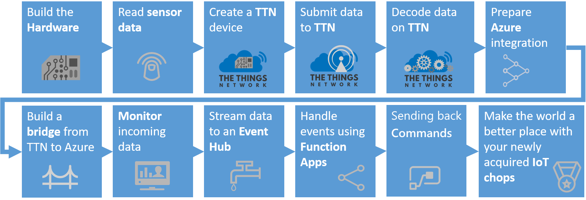

In this chapter you will configure the The Things Uno with two sensors, connect it to The Things Network platform. On the The Things platform you will provision (generate keys for) the The Things Uno, receive its messages and decode the telemetry. As final step in this chapter you will deploy a bridge between the The Things Network platform and Microsoft Azure IoT platform.

*Note: In this workshop, we will create uniquely named Azure resources. The suggested names could be reserved already. Just try another unique name.*

### Prerequisites

During this chapter most of these will be explained in dept.

1. A computer with internet access

2. A The Things Uno, a LED Bar Sensor, a Button Sensor, wiring & a micro USB cable

3. [Arduino IDE](https://www.arduino.cc/en/Main/Software)

4. [Node.js](https://nodejs.org/en/). _(We prefer Version 8)_

5. Azure account [create here](https://azure.microsoft.com/en-us/free/) _([Azure passes](https://www.microsoftazurepass.com/howto) will be present for those who have no Azure account (please check your email for final confirmation))_

6. [TTN account](https://account.thethingsnetwork.org/)

7. Bridge software between TTN and Azure [TtnAzureBridge](https://github.com/sandervandevelde/TtnAzureBridge) (or [as zip](https://aka.ms/workshopiot))

8. [Device Explorer](https://github.com/Azure/azure-iot-sdks/releases). _(Locate the download link for the SetupDeviceExplorer.msi installer. Download and run the installer)_

9. Seeed Grove Led Bar [software library](https://github.com/Seeed-Studio/Grove_LED_Bar) (or [as zip](https://aka.ms/workshopiot))

10. Modern, up-to-date browser like Edge, Chrome and Firefox

## Connect your device


Follow the workshop facilitator connecting the two sensors. A few important things:

- The Button red cable is connected to the `3.3v` pin on the 'The Things Uno'
- The Button yellow cable is connected to the digital pin `4` (fifth pin in the pin header) on the 'The Things Uno'
- The Button black cable is connected to one of the `GND` pins on the 'The Things Uno'
- Note: The white cable of the button is not used
- The LED BAR red cable is connected to the `5v` pin on the 'The Things Uno'
- The LED BAR black cable is connected to one of the `GND` pins on the 'The Things Uno'
- The LED BAR yellow cable is connected to the digital pin `8` on the 'The Things Uno'
- The LED BAR white cable is connected to the digital pin `9` on the 'The Things Uno'

Your device and sensors should be connected as follows:

- Overview

   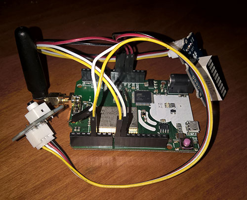

- Details pin layout node

   

- Button pin layout

   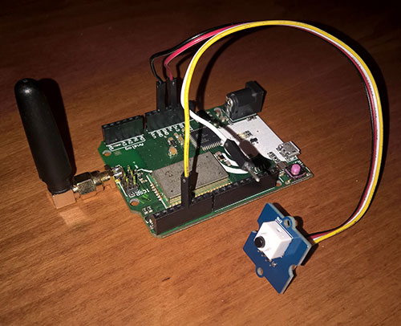

- LED Bar pin layout

   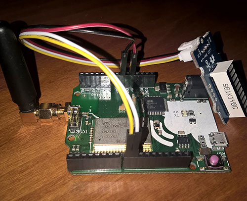

## Read sensors

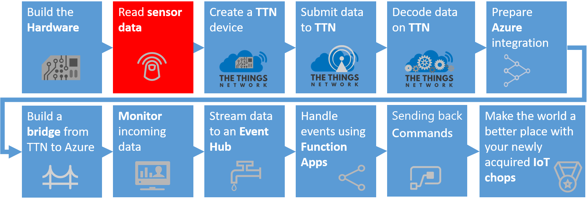

We start with running a simple sketch on the Arduino. This is a program which simulates a machine and when you press a button it 'breaks down'.

1. **Copy** the zip file 'Grove_LED_Bar-master.zip' from [this OneDrive location](https://aka.ms/workshopiot) to a folder (you do _not_ have to **unzip** it)

2. Open the Arduino IDE

3. **Select** menu _Sketch, Include library, Add .ZIP Library_. A dialog to add a library is shown

4. Select the 'Grove_LED_Bar-master.zip' and select **Open**

5. **Check** if the library is imported correctly. A collection (of sketches) named 'Grove_LED_Bar-master' should appear in menu _File, Examples, Examples from Custom Libraries_

6. Connect The Things Uno via the micro USB cable to your computer

7. In the **Tools** menu, click **Board** and select **Arduino Leonardo**

8. In the **Tools** menu, click **Port** and select the serial port of your **COMx (Arduino Leonardo)**

9. Paste the following code in a new sketch:

    ```c
    #include <Grove_LED_Bar.h>

    #define debugSerial Serial

    int commButton = 4;
    int cycleCompleted = 0;
    int errorCode = 0;

    #define debugSerial Serial

    Grove_LED_Bar bar(9, 8, 0);  // Clock pin, Data pin, Orientation

    void setup()
    {
      debugSerial.begin(9600);

      pinMode(commButton, INPUT);

      delay(1000);

      debugSerial.println("Initializing");

      bar.begin();

      bar.setLed(1,1);
      delay(250);
      bar.setLed(1,0);
      bar.setLed(2, 1);
      delay(250);
      bar.setLed(2,0);

      for (int i = 3; i < 11; i++) {
        bar.setLed(i, 1);
        delay(250);
      };

      for (int i = 11; i > 2; i--) {
        bar.setLed(i, 0);
        delay(250);
      };

      bar.setLed(2,1);

      debugSerial.println("Led bar initialized");
    }

    void loop()
    {
      // Simulate police LED lights using setLed method
      for (float i = 0; i < 1.1; i += .100f) {
        bar.setLed(2, 1 - i);
        delay(150);
      };

      for (float i = 0; i < 1.1; i += .100f) {
        bar.setLed(2, i);
        delay(150);
      };

      // If not in error state, update the number of cycles
      if (errorCode == 0) {
        clearProgress(cycleCompleted);
        showProgress(cycleCompleted);
        cycleCompleted++;
        debugSerial.print("Cycle completed: ");
        debugSerial.println(cycleCompleted );
      }

      // In the button is pushed, the machine enters an error state
      if (digitalRead(commButton) == HIGH) {
        errorCode = 99;
        bar.setLed(1,1);
        debugSerial.print("Error occured: ");
        debugSerial.println( errorCode);
        debugSerial.println("Repair of machine needed...");
      }

      // Communicate with TTN about number of cycles and current state (error code)
      byte buffer[2];
      buffer[0] = (byte) cycleCompleted;
      buffer[1] = (byte) errorCode;

      delay(12000);
    }

    void showProgress(int i){
      switch(i % 5){
        case 0:
          bar.setLed(3,1);
          break;
        case 1:
          bar.setLed(4,1);
          break;
        case 2:
          bar.setLed(5,1);
          break;
        case 3:
          bar.setLed(6,1);
          break;
        case 4:
          bar.setLed(7,1);
          break;
      }
    }

    void clearProgress(int i){
      if ((i % 5) == 0) {
          bar.setLed(3,0);
          bar.setLed(4,0);
          bar.setLed(5,0);
          bar.setLed(6,0);
          bar.setLed(7,0);
      }
    }
    ```

10. In the **Sketch** menu, click **Verify/Compile**

11. Go to the **Tools** menu and open the **Serial Monitor**

12. Go back to the **Sketch** menu and click **Upload**

13. Once the sketch has been uploaded, You should see output like this.

14. Just wait a few seconds before pushing the button (please push and hold until the error message occurs):

    ```cmd/sh
    Initializing
    Led bar initialized
    Cycle completed: 1
    Cycle completed: 2
    Cycle completed: 3
    ...
    Error occured: 99
    Repair of machine needed...
    ```

*Note*: The red LED on the LED bar should be lit too.

Now we have a running Arduino with some basic logic. Let's send some messages using The Things Network.

## Create The Things Network application in the The Things Network portal


Follow the steps to create an application and register your device.

1. Log into the [The Things Network dashboard](https://console.thethingsnetwork.org) using a modern browser like Chrome. You will be asked to provide TTN credentials if needed
2. A selection between Applications maintenance and Gateways maintenance must be made. In Console, choose **Applications**

    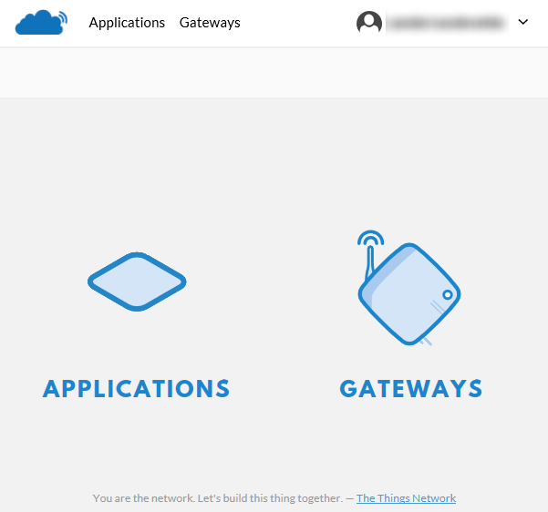

3. A The Things Network application is a logical container of several devices, providing the same telemetry. There are no TTN applications yet

    

4. Add a new application. Pick a unique Application ID (for example `predictive_maintenance` in lower case) and fill in a description

    

5. Press **Add application**. The application is added
6. Go to **Devices**

    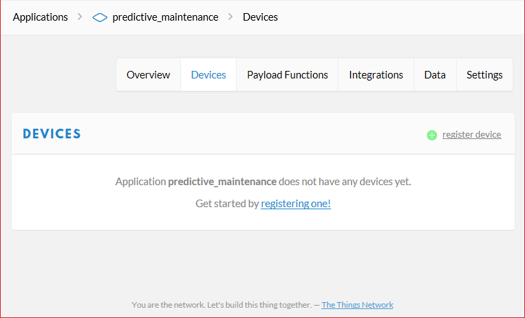

7. Click **Register device**
8. Enter a **Device ID** (for example `predictive_maintenance_machine_42` in lower case)

    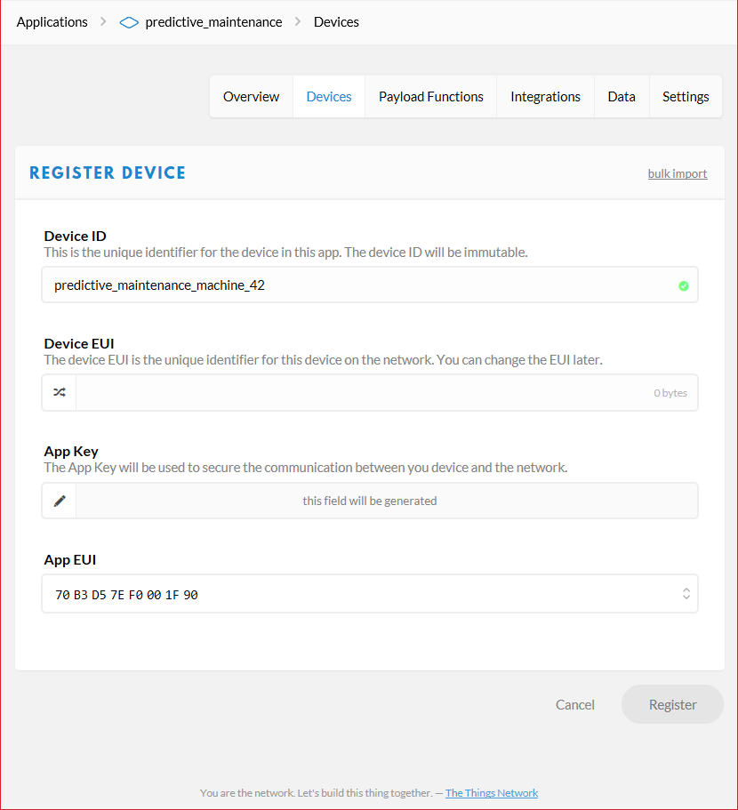

9. Notice that the Register button is still disabled. A device needs a unique identifier
10. Click the **Generate** icon for 'Device EUI' so a unique EUI can be generated on register

    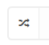

11. The text in the 'Device EUI' textbox is changed

12. The register button is now enabled. Click **Register**

13. The device is now created

    

14. Now we have to fine tune the settings

15. Click **Settings** in the upper right corner

16. Select activation method **ABP** instead of OTAA

17. And uncheck **Frame counter checks** *Note: As stated, Disabling frame counter checks drastically reduces security and should only be used for development purposes. In this workshop, this makes you more flexible*

    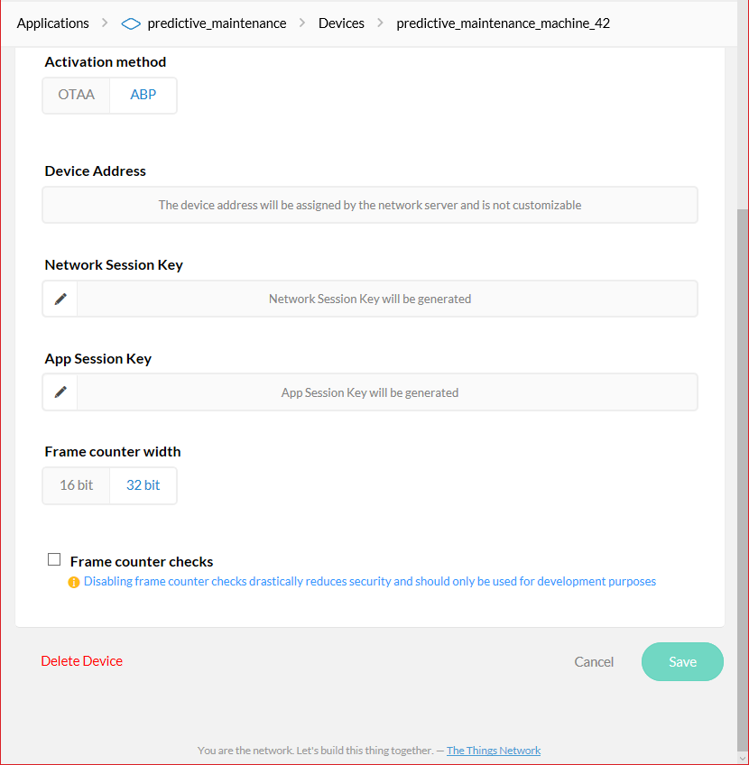

18. Click **Save**

19. The following device settings are shown

    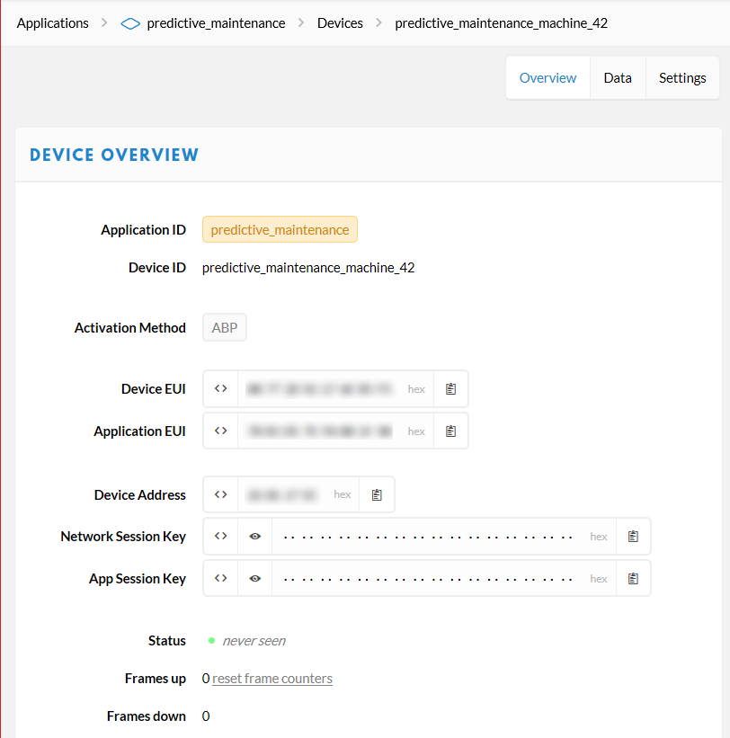

20. Keep this page open, you need the device address, network session key and application session key in a minute

The TTN application is now created. And your device has been registered and provisioned. Let's use the keys to connect.

## Send telemetry from your device to the The Things Network platform


The sensor data is read, now it is time to send the sensor data to the The Things Network platform.

1. First we have to reference the The Thinks Network library for Arduino. **Open** the Arduino IDE

2. **Select** menu _Sketch, Include library, Manage Libraries_. A form named 'Library Manager' is shown

3. **Search** for The Things Network library using the keyword 'TheThingsNetwork'

4. A single library is shown. **Select** the library and **Install** the library

5. Close the Library manager

6. In the Arduino IDE, from the **File** menu, choose **New** to create a new sketch and paste the following code:

    ```c
    #include <Grove_LED_Bar.h>
    #include <TheThingsNetwork.h>

    const char *devAddr = "00000000";
    const char *nwkSKey = "00000000000000000000000000000000";
    const char *appSKey = "00000000000000000000000000000000";

    #define loraSerial Serial1
    #define debugSerial Serial

    #define freqPlan TTN_FP_EU868

    TheThingsNetwork ttn(loraSerial, debugSerial, freqPlan);

    int commButton = 4;
    int cycleCompleted = 0;
    int errorCode = 0;

    #define debugSerial Serial
    #define loraSerial Serial1

    Grove_LED_Bar bar(9, 8, 0);  // Clock pin, Data pin, Orientation

    void setup()
    {
      loraSerial.begin(57600);
      debugSerial.begin(9600);

      pinMode(commButton, INPUT);

      delay(1000);

      debugSerial.println("Initializing");

      // Initializing TTN communication...
      ttn.personalize(devAddr, nwkSKey, appSKey);

      debugSerial.println("The Things Network connected");
      // nothing to initialize
      bar.begin();

      bar.setLed(1,1);
      delay(250);
      bar.setLed(1,0);
      bar.setLed(2, 1);
      delay(250);
      bar.setLed(2,0);

      for (int i = 3; i < 11; i++) {
        bar.setLed(i, 1);
        delay(250);
      };

      for (int i = 11; i > 2; i--) {
        bar.setLed(i, 0);
        delay(250);
      };

      bar.setLed(2,1);

      debugSerial.println("Led bar initialized");
    }

    void loop()
    {
      // Simulate police LED lights using setLed method
      for (float i = 0; i < 1.1; i += .100f) {
        bar.setLed(2, 1 - i);
        delay(150);
      };

      for (float i = 0; i < 1.1; i += .100f) {
        bar.setLed(2, i);
        delay(150);
      };

      // If not in error state, update the number of cycles
      if (errorCode == 0) {
        clearProgress(cycleCompleted);
        showProgress(cycleCompleted);
        cycleCompleted++;
        debugSerial.print("Cycle completed: ");
        debugSerial.println(cycleCompleted );
      }

      // In the button is pushed, the machine enters an error state
      if (digitalRead(commButton) == HIGH) {
        errorCode = 99;
        bar.setLed(1,1);
        debugSerial.print("Error occured: ");
        debugSerial.println( errorCode);
        debugSerial.println("Repair of machine needed...");
      }

      // Communicate with TTN about number of cycles and current state (error code)
      byte buffer[2];
      buffer[0] = (byte) cycleCompleted;
      buffer[1] = (byte) errorCode;

      // send message to TTN
      ttn.sendBytes(buffer, sizeof(buffer));

      delay(12000);
    }

    void showProgress(int i){
      switch(i % 5){
        case 0:
          bar.setLed(3,1);
          break;
        case 1:
          bar.setLed(4,1);
          break;
        case 2:
          bar.setLed(5,1);
          break;
        case 3:
          bar.setLed(6,1);
          break;
        case 4:
          bar.setLed(7,1);
          break;
      }
    }

    void clearProgress(int i){
      if ((i % 5) == 0) {
          bar.setLed(3,0);
          bar.setLed(4,0);
          bar.setLed(5,0);
          bar.setLed(6,0);
          bar.setLed(7,0);
      }
    }
    ```

7. Insert your device address in `devAddr`, network session key in `nwkSkey` and application session key in `appSKey`. You can use the handy `clipboard` button in the dashboard to copy it quickly as a HEX/C-Style value

    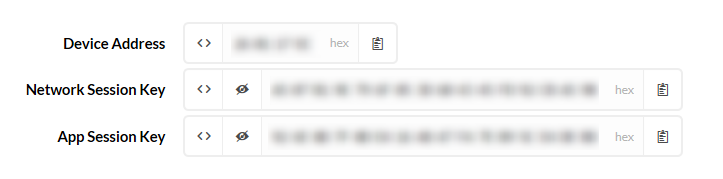

8. In the **Sketch** menu, click **Upload**
9. Open the **Serial Monitor** again from the **Tools** menu once upload has completed. Your device should now be sending telemetry to The Things Network

    

10. In The Things Network dashboard, go to **Data**. You see uplink packets arriving (the 63 occurs when you push and hold the button):

    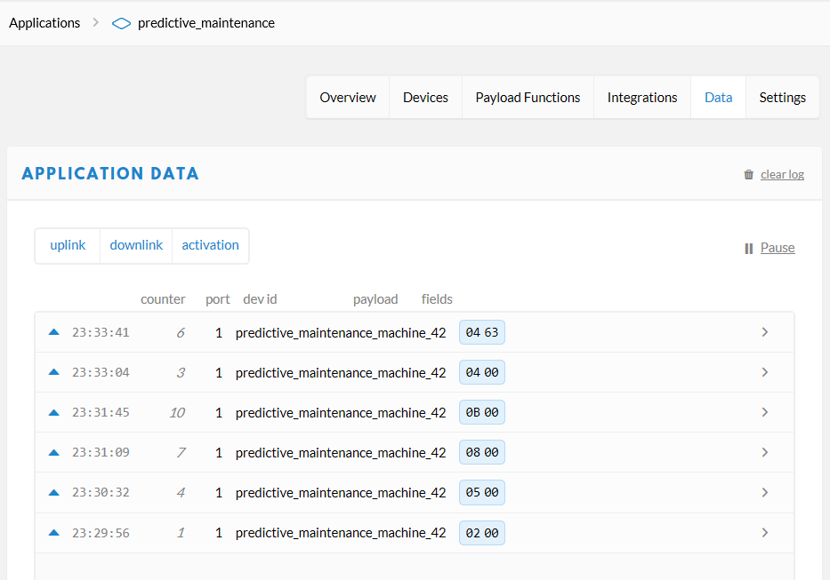

We are now receiving raw telemetry. We can decode and transform this in the TTN portal towards JSON messages.

## Decode data on TTN


Now, the hexidecimal payload is an efficient format for LoRa communication but it is not really useful upstream. We want human readable JSON. To decode and convert the hexidecimal payload to JSON messages, we have payload formats.

1. In the application overview, click **Payload Formats**
2. Add the following **decoder** payload format to decode the two bytes back to the decimal number of cycles completed and the current state:

    ```c
    function Decoder(bytes, port) {
      var cyclesCompleted = bytes[0];
      var errorCode = bytes[1];

      return {
        cyclesCompleted: cyclesCompleted,
        errorCode: errorCode
      };
    }
    ```

3. You have to test this decoder function before you can save the function. Enter eg. '2A00' in the payload and click **Test**. The hexidecimal payload entered is shown in JSON format as test result

    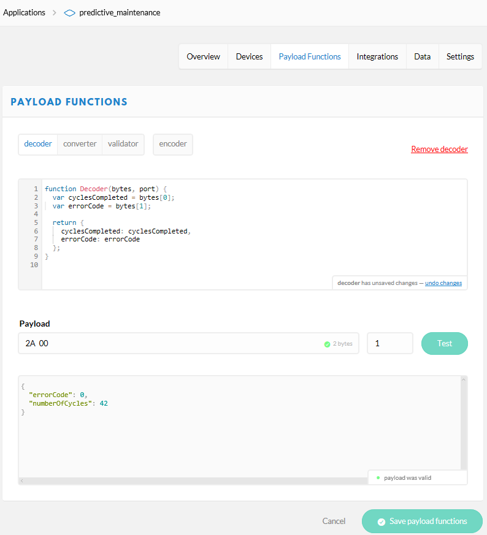

4. We also want to rearrange (convert) the order of the JSON elements. To rearrange the order we use the following function as the **converter** payload format:

    ```c
    function Converter(decoded, port) {
      return {
        errorCode: decoded.errorCode,
        numberOfCycles: decoded.cyclesCompleted
      };
    }
    ```

5. Again, you have to test this converter payload format before you can save the function. Enter eg. '2A00' in the payload and click **Test**. The hexidecimal payload entered is shown in JSON format with rearranged elements as test result

6. Finally, scroll to the bottom of the page and click **Save**

7. Go back to your data overview. Now you should see something like this:

    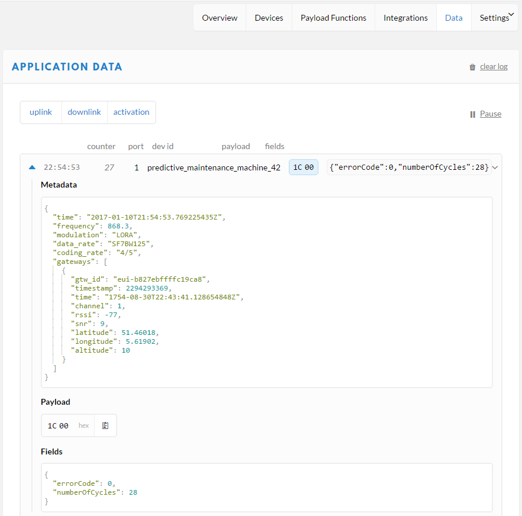

Now we have clean JSON data ready to be processed. But it's still at the TTN portal. Let's connect the Azure IoT Portal to read this upstream data.

## Configuring the Azure IoT platform to receive telemetry

Futher processing of the telemetry on the The Things Network platform is not possible. Processing telemetry has to be done on your own IoT plaform of your choice. In this case we choose the Azure IoT platform.

But first we need the secrets from the The Things Network platform to be able to create a secure connection between the TTN and your own platform. A secure connection between platforms is called a bridge. We will configure and deploy a bridge with the Azure IoT Hub.

### Collect TTN Application secrets

We have to collect unique keys of the The Things Network application.

1. Go to your The Things Network application **Overview** in the navigation bar
2. **Write down** the 'Application ID'
3. Scroll down to **Access Keys**. **Write down** the default 'Access Key'

    

The `Application ID` and `Access Key` are required to get data from The Things Network.

### Create an Azure IoT Hub


Follow these steps to create an Azure IoT Hub.

1. Log into the [Azure portal](https://portal.azure.com/). You will be asked to provide Azure credentials if needed
2. On the left, a number of common Azure services are shown. Select `All Services` to open a list with all available services

    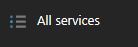

3. Filter it with `IoT Hub`

    

4. Select `IoT Hub` and a new blade will be shown. Select `Add` and you will be asked to enter the information needed to create an IoT Hub

    

5. Enter a unique IoT Hub name eg. `IoTWorkshop-ih`. A green sign will be shown if the name is unique

6. Enter a unique Resource Group eg. `IoTWorkshop-rg`. A green sign will be shown if the name is unique

7. Select `West Europe` for the location, if needed

    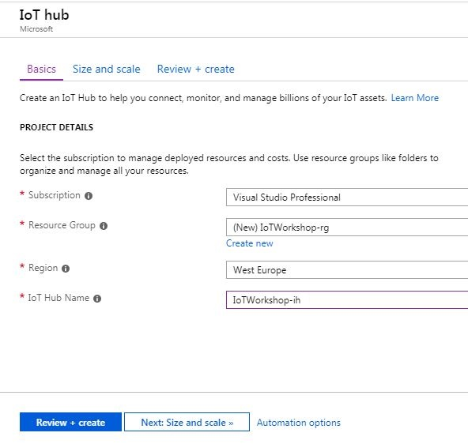
    
8. Press `Next: Size and scale`
    
    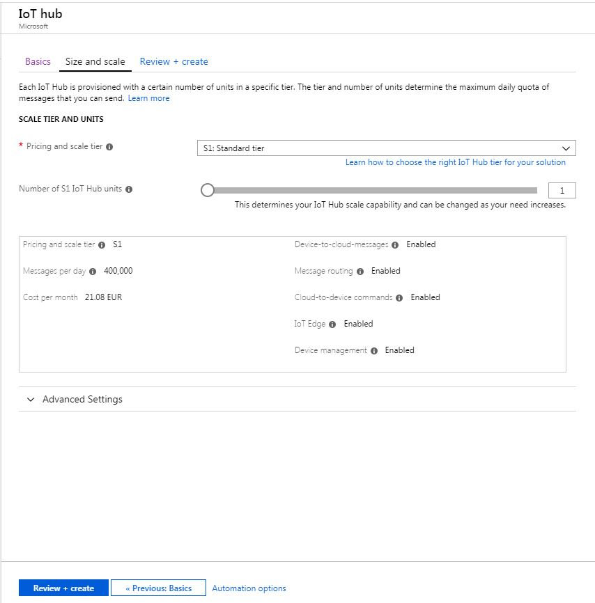

9. Press `Review + create` and check your input. Press `Create` the portal will start creating the service. Once it is created, a notification is shown. In the right upper corner, a bell represents the list of all notifications shown

    

Creating an IoT Hub takes some time.

### Collect Azure IoT Hub secrets

The bridge requires an Azure IoT Hub Shared access policy key name with `Registry read, write and Device connect` permissions. In this example, we use the **iothubowner** policy which has these permissions enabled by default.

1. Check the Azure portal. The resource group and the IoT Hub has to be created before we continue...

    

2. On the left, select `Resource groups`. A list of resource groups is shown

    

3. Select the resource group `IoTWorkshop-rg`. It will open a new blade with all resources in this group

4. Select the IoT Hub `IoTWorkshop-ih`. It will open a new blade with the IoT Hub

    

5. The IoTHub has not received any messages yet. Check the general settings for `Shared access policies`

    

6. **Write down** the `name` of the IoT Hub eg. `IoTWorkshop-ih`

7. Navigate to the 'iothubowner' policy and **write down** both the `Primary Key` and the `Connection String-Primary Key`, the **first full Connection String**

    

These are all the secrets needed from the Azure IoT Hub.

## Create a bridge


Telemetry is arriving at the TTN portal. But we want to pass it on to the Azure IoT Platform. We need to build a 'bridge'.

Follow these steps to create the integration bridge between The Things Network and Azure IoT Hub.

*Note: The bridge below is build using C# and will not run on non-windows devices. If you are unable to run the bridge locally, deploy the bridge in the cloud as described in [Deploying The Things Network Bridge to Azure as a WebJob](Webjob.md)*

*Note: The bridge is actually an open source project on [github](https://github.com/sandervandevelde/TtnAzureBridge). We accept pull requests :-)*

1. **Create** a new folder eg. `c:\IoTWorkshop`

2. **Copy** the zip file 'TTNAzureBridge.zip' from [this OneDrive location](https://aka.ms/workshopiot) to this folder and **unzip/extract** it _(Note: on some corporate networks, access to onedrive is limited. Ask the organization for a copy of the zip)_

    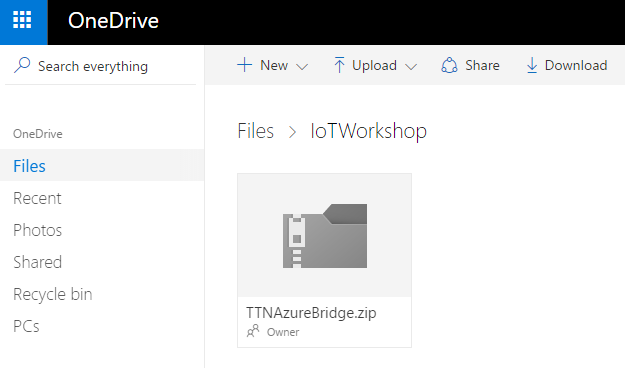

3. **Navigate** to the folder with the executable and identify the config file name 'TtnAzureBridge.exe.config'
4. **Open** this config file in notepad or another text file editor

5. **Replace** [TTN App Id] with the `TTN Application ID`

6. **Replace** [TTN App Access Key] with the `TTN Access Key`

7. **Replace** [iothub name] with the `name` of the IoT Hub in the app settings

8. In the connectionstring of 'IoTHub', [shared access key] with the remembered `Primary Key` *Note*: actually, this connectionString should resemble the full IoTHub connectionstring

   

9. **Save** the config file and close the editor

The bridge is now ready for execution.

### Start the bridge

You are about to retrieve the telemetry from the The Things Network platform.

1. At the command prompt (press Windows button-R, type CMD and enter), navigate to the new folder `c:\iotworkshop`

2. In the same folder, **run** `TtnAzureBridge.exe` to verify the bridge is working

   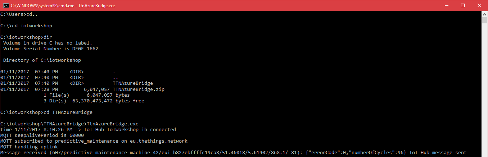

3. This is example output:

    ```cmd/sh
    time 1/11/2017 8:16:29 PM -> IoT Hub IoTWorkshop-ih connected
    MQTT KeepAlivePeriod is 60000
    MQTT subscribed to predictive_maintenance on eu.thethings.network
    MQTT handling uplink
    Message received (2/predictive_maintenance_machine_42/eui-b827ebffffc19ca8/51.46018/5.61902/868.1/-76): {"errorCode":0,"numberOfCycles":3}-IoT Hub message sent
    MQTT handling uplink
    Message received (12/predictive_maintenance_machine_42/eui-b827ebffffc19ca8/51.46018/5.61902/868.1/-77): {"errorCode":0,"numberOfCycles":13}-IoT Hub message sent
    ...
    ```

4. The telemetry is passed to the connect Azure IoTHub. We also see some basic information about the frame count, the node, the name and registered GPS location of the gateway, the Lora channel used and the quality of the reception (RSSI)

*Note: the message consists of valid JSON telemetry.*

*Note: Keep the bridge running until the end of the complete workshop.*

## Monitoring


We can check the arrival of messages in the Azure IoT Hub. This can be done using a UI app named Device Explorer.

### Monitoring using UI

We can check the arrival of the messages in the Azure IoT Hub using the Device Explorer.

The Device Explorer tool is a Windows-only graphical tool for managing your devices in IoT Hub.

The easiest way to install the Device Explorer tool in your environment is to download the pre-built version by clicking [Azure IoT SDKs releases](https://github.com/Azure/azure-iot-sdks/releases). _(Locate the download link for the SetupDeviceExplorer.msi installer. Download and run the installer)_

1. Start the **Device Explorer** from the desktop or using the start menu

2. On the Configuration Tab, insert the IoT Hub **Connection String**. Leave the **Protocol Gateway Hostname** empty

3. Press **Update**

4. On the Management tab, your **device** should already be available. It was **registered** by the bridge the very first time, telemetry arrived

    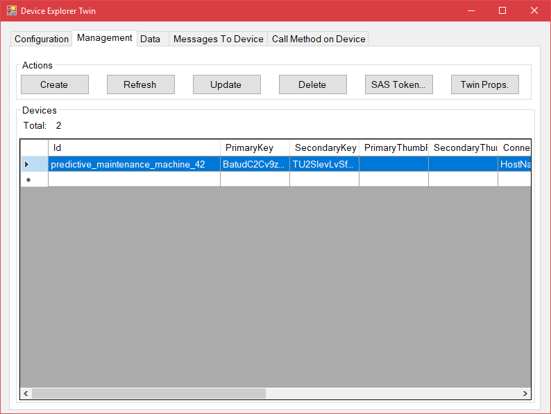

5. On the Data tab, Select your **Device ID** (like 'predictive_maintenance_machine_42') and press **Monitor**

6. Now we **check the leds** on the device for Sending cycle updates a couple of times. This will result in the following messages while Duty Cycle telemetry is sent by the device

    ```cmd/sh
    Receiving events...predictive_maintenance_machine_42
    1/5/2017 9:46:18 PM> Device: [predictive_maintenance_machine_42], Data:[{"errorCode":0,"numberOfCycles":1}]
    1/5/2017 9:46:19 PM> Device: [predictive_maintenance_machine_42], Data:[{"errorCode":0,"numberOfCycles":2}]
    1/5/2017 9:46:20 PM> Device: [predictive_maintenance_machine_42], Data:[{"errorCode":0,"numberOfCycles":3}]
    ```

## Conclusion

The messages are shown in the TTN portal, in the Bridge and in the IoTHub monitoring tooling. So we have proof of the arrival of these messages in the Azure IoT portal.

Next Step: You are now ready to process your data in an Azure Function. Continue to [Receiving and handling The Things Network telemetry in Azure](AzureTTN.md)

 
