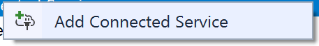

## Connecting to an IoT Hub using a UWP app device simulation


This is an example integration between a UWP app and Azure IoT Hub. This integration shows features like creating devices in the Azure IoT Hub device registry as well as sending telemetry to the IoT Hub.

*Note: In this workshop, we will create uniquely named Azure resources. The suggested names could be reserved already. Just try another unique name.*

*Note: The IoT Hub also offers the ability to send commands back to devices. This is not part of this workshop.*

### Prerequisites

1. A Windows 10 computer with internet access
2. Visual Studio 2015 [Community edition](https://www.visualstudio.com/vs/community/) or higher
3. Universal Windows App Development Tools [Windows SDK](https://developer.microsoft.com/en-US/windows/downloads/windows-10-sdk)
4. Visual Studio Extension [Connected Service for Azure IoT Hub](https://visualstudiogallery.msdn.microsoft.com/e254a3a5-d72e-488e-9bd3-8fee8e0cd1d6)
5. App for checking out the Azure IoT Platform [Device Explorer](https://github.com/fsautomata/azure-iot-sdks/blob/master/tools/DeviceExplorer/doc/how_to_use_device_explorer.md) _(for GUI based usage; see below for installation steps)_  
6. Azure account [create here](https://azure.microsoft.com/en-us/free/) _([Azure passes](https://www.microsoftazurepass.com/howto) will be present for those who have no Azure account (please check your email for final confirmation))_

### Objectives

In this workshop, you will learn:

1. Creating an IoT Hub in the Azure Portal
2. Creating a new UWP App
3. Connect to the IoT Hub and register the app like a device
4. Generate and send dummy telemetry
5. Check the arrival of the telemetry

## Creating an Azure IoT Hub in the Azure portal


Follow these steps to create an Azure IoT Hub.

1. Log into the [Azure portal](https://portal.azure.com/). You will be asked to provide Azure credentials if needed
2. On the left, a number of common Azure services are shown. Select `More Services` to open a list with all available services

    

3. Filter it with `IoT Hub`

    

4. Select `IoT Hub` and a new blade will be shown. Select `Add` and you will be asked to enter the information needed to create an IoT Hub

    

5. Enter a unique IoT Hub name eg. `IoTWorkshop-ih`. A green sign will be shown if the name is unique
6. Enter a unique Resource Group eg. `IoTWorkshop-rg`. A green sign will be shown if the name is unique
7. Select `West Europe` for the location, if needed

    

8. Press `Create` and the portal will start creating the service. Once it is created, a notification is shown. In the right upper corner, a bell represents the list of all notifications shown

    

Creating an IoT Hub takes some time. Meanwhile, we will start with the app which will connect to the IoT Hub later on.

## Creating a new UWP App


We will create a UWP app in Visual Studio. These apps are called Universal Windows Apps because they are supported by all sorts of devices running Windows 10. This includes laptops, PC's, Mobile devices like phones and tablets, the Xbox One, The Surface Hub, The Hololens and even the Raspberry Pi.

*Note: Our app will simulate a machine which handles batches of work. It passes the increasing number of finished duty cycles every X seconds to the cloud. And we can simulate outage later on*

1. Start Visual Studio
2. On the Start Page or using the Menu, select New Project...

    

3. In the dialog, select the `Blank App (Universal Windows)` template

    

4. Select `Ok`. If you are asked which minimal platform version must be loaded, just press `Ok` again

    

    *Note: If you do not have the Windows 10 Aniversary edition installed, please select the previous SDK*
 
5. Press `F6` or use the menu `BUILD|Build Solution` to recompile the app and check if the build completes without errors

    

6. Start the app by pressing `F5` or use the menu `DEBUG|Start Debugging`
7. The app starts and an empty form is shown

The app is created. You are now ready to add a connection to the IoT Hub.

## Connect to the IoT Hub and register the app like a device


Let's add a connection to IoT hub and register the app like a real device.

1. Stop the running app using, if the app is on top, `ALT-F4` or the menu `DEBUG|Stop debugging`
2. Go to the solution Explorer to the right. You can see the application has one page called MainPage.xaml

    

3. In the solution, right-click `References` and select `Add Connected Service`

    

4. A welcome screen for the extension will be shown. Select `Azure IoT Hub` and click `Configure` to add it as a Connected Service

    

5. Select `Hardcode shared access key` as Security Mode. Confirm with `OK`
6. Now you will be asked to select the IoT Hub you want to connect. At this time, the Hub should be created. *If you have multiple Azure accounts, please double-check that the correct one is selected*

    

7. Select your IoT Hub and press `Add`
8. The next page of the wizard is shown. A little screen pops up asking to select or add a device. Our app will represent a device and therefore access must be granted. Select `New Device`

    

9. Enter a unique `device name` eg 'MachineCyclesUwp'

    

10. The device is registered, you are allowed to create more devices. Unique credentials are created for each device in the background
11. But afterward, be sure to pick the 'MachineCyclesUwp'; this one will be used by our app. Select `OK` to start the generation of the connection

    

12. The necessary NuGet libraries are added and eventually you will be directed to a [Get Started page](https://github.com/Azure/azure-iot-hub-vs-cs/wiki/C%23-Usage) for more information
13. In the Solution Explorer of Visual Studio, a new file named 'AzureIoTHub.cs' is added. This provides all logic for the connection to the IoT Hub

    

The AzureIoTHub can be integrated into the logic of our App. Let's do that.

## Generate and send dummy telemetry


We will use the connection later on. But first let's check out the 'AzureIoTHub.cs' file because it needs some rework.

1. `Open` the file named 'AzureIoTHub.cs'
2. The file contains a class named which has two methods: 'SendDeviceToCloudMessageAsync' and 'ReceiveCloudToDeviceMessageAsync'. *Note: receiving Cloud to Device messages will be discussed later on*
3. The method to send data is not that intelligent. It only sends a text message. `Add the following code` just below it

    ```csharp
    public static async Task SendDeviceToCloudMessageAsync(Telemetry telemetry)
    {
     var deviceClient = DeviceClient.CreateFromConnectionString(deviceConnectionString, TransportType.Amqp);

        var message = new Message(Encoding.ASCII.GetBytes(Newtonsoft.Json.JsonConvert.SerializeObject(telemetry)));

        await deviceClient.SendEventAsync(message);
    }

    public class Telemetry
    {
        public int errorCode { get; set; }

        public int numberOfCycles { get; set; }
    }
    ```

4. We have defined the Telemetry class which will hold the number of cycles. And the current error code of the device can be passed to the cloud. The telemetry is converted to JSON
6. `Open` the 'XAML' file named 'MainPage.xaml'. The empty page will be shown both in a visual editor and a textual XAML editor
7. The page contains one component, a grid. But that grid is merely a container for other visual components
8. In the XAML editor, within the grid, `add`

    ```xml
    <StackPanel>
        <TextBlock Name="txbTitle" Text="Machine Cycles Demo" Margin="5"  FontSize="100" IsColorFontEnabled="True" Foreground="DarkOliveGreen" />
        <Button Name="BtnSend" Content="Send cycle updates" Margin="5" FontSize="60" Click="btnSend_Click" />
        <Button Name="BtnBreak" Content="Break down" Margin="5" FontSize="60" Click="BtnBreak_OnClick" />
        <TextBlock Name="TbMessage" Text="---" FontSize="60" />
    </StackPanel>
    ```

9. Three buttons and two text blocks are put on the screen. Go to the code-behind source code which will be executed when the buttons are clicked. 
10. Press `F7`, the file 'MainPage.xaml.cs' is shown. 
11. Only the constructor of this page is shown. `Add` the following members and methods 

    ```csharp
    private int _cycleCounter;

    private int _errorCode;

    private async void btnSend_Click(object sender, RoutedEventArgs e)
    {
        try
        {
            await ShowMessage("Sending...");

            if (_errorCode == 0)
            {
                _cycleCounter++;
            }

            var t = new AzureIoTHub.Telemetry
            {
                errorCode = _errorCode,
                numberOfCycles = _cycleCounter,
            };

            await AzureIoTHub.SendDeviceToCloudMessageAsync(t);

            await ShowMessage($"Telemetry sent (Cycle: {_cycleCounter}, State: {_errorCode})");
        }
        catch (Exception ex)
        {
            await ShowMessage(ex.Message);
        }
    }

    private async Task ShowMessage(string text)
    {
        await Dispatcher.RunAsync(
                CoreDispatcherPriority.Normal, () =>
                {
                    TbMessage.Text = text;
                });
    }

    private async void BtnBreak_OnClick(object sender, RoutedEventArgs e)
    {
        try
        {
            BtnBreak.IsEnabled = false;

            _errorCode = 99;

            txbTitle.Foreground = new SolidColorBrush(Colors.Red);

            await ShowMessage("Machine is now broken, cycles have stopped; have to Notify!");
        }
        catch (Exception ex)
        {
            await ShowMessage(ex.Message);
        }
    }
    ```

12. The method 'btnSend_Click' now increases the number of duty cycles and sends it to the IoT Hub using the unique access token of the device 'MachineCyclesUwp'
13. New libraries references are introduced in this code. `Add` two times a 'using' at the top of the editor

    ```csharp
    using System;
    using System.Threading.Tasks;
    using Windows.UI;
    using Windows.UI.Core;
    using Windows.UI.Xaml;
    using Windows.UI.Xaml.Controls;
    using Windows.UI.Xaml.Media;
    ```

14. The app is now ready. `Run` the app and first send some cycle updates. It the message 'Telemetry sent' is shown, our telemetry is accepted by the IoT Hub

    

Now we have sent telemetry to the Event Hub. Let's check if it's arrived.

## Monitoring the arrival of the telemetry in Azure

We can monitor the arrival of telemetry only if we have enough rights to look into the IoT Hub. So first we collect secrets.

### Collect Azure IoT Hub secrets

The integration requires an Azure IoT Hub Shared access policy key name with `Registry read, write and Device connect` permissions. In this example, we use the **iothubowner** policy which has these permissions enabled by default.

1. Check the Azure portal. The resource group and the IoT Hub should be created by now (otherwise, we were unable to send duty cycles information to it)

    

2. On the left, select `Resource groups`. A list of resource groups is shown

    

3. Select the resource group `IoTWorkshop-rg`. It will open a new blade with all resources in this group
4. Select the IoT Hub `IoTWorkshop-ih`. It will open a new blade with the IoT Hub

    

5. The IoTHub has not received any messages yet. Check the general settings for `Shared access policies`

    

6. **Write down** the `name` of the IoT Hub eg. `IoTWorkshop-ih`
7. Navigate to the 'iothubowner' policy and **write down** this `Connection String-Primary Key`

    

This is the secret needed from the Azure IoT Hub.

## Select your favorite tool for monitoring


We can check the arrival of messages in the Azure IoT Hub. This can be done using a UI app named Device Explorer or using a Command-Line tool named IoT Hub Explorer. `Choose one below` 

### Monitoring using Device Explorer

We can check the arrival of the messages in the Azure IoT Hub using the Device Explorer.

The Device Explorer tool is a Windows-only graphical tool for managing your devices in IoT Hub.

The easiest way to install the Device Explorer tool in your environment is to download the pre-built version by clicking [Azure IoT SDKs releases](https://github.com/Azure/azure-iot-sdks/releases). Scroll down to the Downloads section to locate the download link for the SetupDeviceExplorer.msi installer. Download and run the installer.

To run the Device Explorer tool, double-click the DeviceExplorer.exe file in Windows Explorer. The default installation folder for this application is C:\Program Files (x86)\Microsoft\DeviceExplorer.

1. Start the `Device Explorer` from the desktop or using the start menu
2. On the Configuration Tab, insert the IoT Hub `Connection String-primary key` and the `name` of the IoT Hub (as Protocol Gateway Hostname)
3. Press `Update`
4. On the Management tab, your device should already be available. It was registered by the bridge the very first time, telemetry arrived

    

5. On the Data tab, Select your `Device ID` (like 'MachineCyclesUwp') and press `Monitor`
6. in the UWP app, press `Send cycle updates` a couple of times
7. This will result in the following messages when you send some Duty Cycle telemetry in your UWP app

    ```
    Receiving events...
    1/5/2017 9:46:18 PM> Device: [MachineCyclesUwp], Data:[{"errorCode":0,"numberOfCycles":1}]
    1/5/2017 9:46:19 PM> Device: [MachineCyclesUwp], Data:[{"errorCode":0,"numberOfCycles":2}]
    1/5/2017 9:46:20 PM> Device: [MachineCyclesUwp], Data:[{"errorCode":0,"numberOfCycles":3}]
    ```

## Conclusion

These messages shown during the monitoring step are now available in Azure, and kept in the IotHub until other resources are asking for telemetry...

Next Step: You are now ready to process your data in an Azure Function. Continue to [Receiving and handling telemetry in Azure](AzureUWP.md)


