# The Things Network & Azure IoT: a perfect combination
## Deploying The Things Network Bridge to Azure as a WebJob

Remember creating the TTN bridge locally on your computer? Will your PC be always on? Most likely not, therefore it seems reasonable to deploy the TTNAzureBridge somewhere else. What place is better than the Azure cloud?

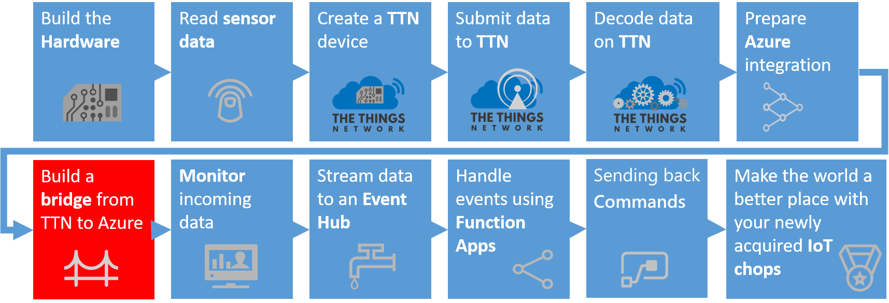

*Note: In this workshop, we will create uniquely named Azure resources. The suggested names could be reserved already. Just try another unique name.*

### Prerequisites

1. The TTN Azure bridge deployed/running on your computer _(like the one created earlier in the workshop)_

### Collect the parts we need

Follow these steps to collect all parts before we can deploy to Azure.

1. If the bridge is still running, stop the running bridge with `ctrl c`.
    
    

2. `Open` a File Explorer and browse to the directory `c:\iotworkshop`. 
3. `Check` if the 'TTNAzureBridge.zip' is still available. This should be the same file you downloaded from [this OneDrive location](https://1drv.ms/f/s!At-2dMPHYH4-kP0ENT3ieMCvJPxeKA) to this folder
4. `Navigate` to the folder with the executable and identify the config file name 'TtnAzureBridge.exe.config'
5. The config file should still contain the complete app settings 'ApplicationEui', 'ApplicationAccessKey', 'IotHubName' and the connection string 'IoTHub'

We need both the zip file and the secrets. *Note: the config file inside the zip file does **not** contain the secrets*

### Deploy Azure WebJob

Follow these steps to deploy a console app as Azure WebJob that runs the integration between The Things Network and Azure IoT Hub.

1. `Log into` the [Azure portal](https://portal.azure.com/). You will be asked to provide Azure credentials if needed
2. On the left, select `Resource groups`. A list of resource groups is shown

    

3. Select the ResourceGroup `IoTWorkshop-rg`. It will open a new blade with all resources in this group

4. Select `Add`. A list of available services appears

    

5. Filter it with `web app` and select `Web App`

    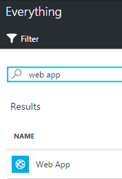

6. An introduction will be shown. Select `Create`
7. A dialog for the new Web App is shown
8. Enter a unique Web App name eg. `IoTWorkshop-wa`. A green sign will be shown if the name is unique
9. The Resource Group eg. 'IoTWorkshop-rg' is already filled in
10. The App Service plan eg. is filled with a non-specific one

    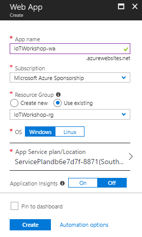

11. Open the App Service plan blade and select Create New

    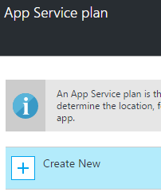

12. Enter a unique App name eg. `IoTWorkshop-asp`. A green sign will be shown if the name is unique
13. Select `West Europe` for the location
14. The Pricing tier will be left unaltered
15. Select `Ok`
16. Our new App Service plan is now added to the Azure Function App

    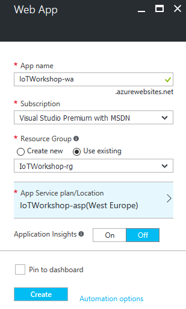

17. Select `Create`
18. Creating a Web App will take some time, but we want to complete this step
19. So navigate back to the resource group (repeat step 1, 2 and 3) and meanwhile check the Web app creation in the resource group
20. If the Web App becomes listed, select `IoTWorkshop-wa`. Otherwise, 'refresh' the list a few times

    

21. You are now in the Web App blade. It should be shown like this, with all information available (otherwise, refresh a few times):

    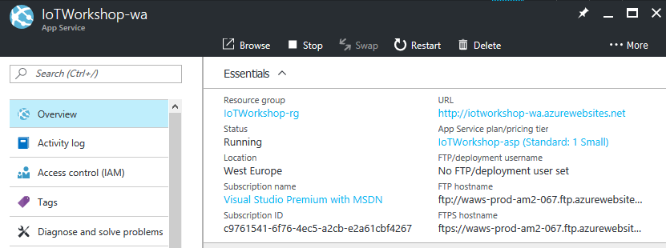

22. A Web App has dozens of settings. Filter the settings for `webjobs`

    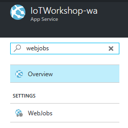

23. Select `WebJobs`. An empty list is presented
24. Select `Add`

    

25. Enter a unique Web App name eg. `TTNAzureBridge`. A green sign will be shown if the name is unique
26. Select your bridge ZIP file (eg. 'TTNAzureBridge.zip') as file to upload
27. Ensure that the type is set to `Continuous`
28. Set the scale to `Single Instance`

    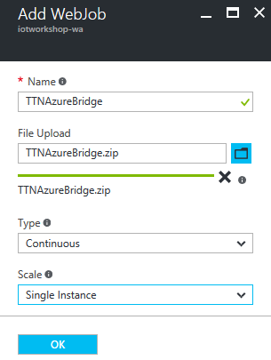

29. Select `Ok`
30. The Web Job will be created. And it is listed on the page of the Web App

    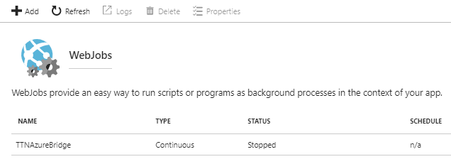

31. But actually, this job is not ready to run yet. We need to add settings
32. `Clear` the settings filter. 
33. Select `Application settings`
34. The Application settings pane is shown. `Scroll down` until both the App Settings and Connection Strings are shown

    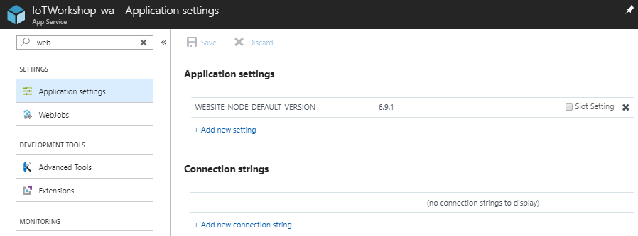

35. We will enter the actual settings here. These will override the settings in the config file of the bridge *Note: this is a great feature for administrators*
36. Add for each app setting the name and value
    1. ApplicationId
    2. ApplicationAccessKey
    2. IotHubName
37. If in an unforeseen event that the connection to the TTN is lost, we let the Web App restart the web job. Add this extra setting and give it the value `True` 
    1. ExitOnConnectionClosed (value 'True')  
38. We also have to add the connection string. Fill in both the name, connection string. Finally, set the kind to `Custom`
    1. IoTHub (value kind 'Custom')
39. The settings are now ready and should look like this

    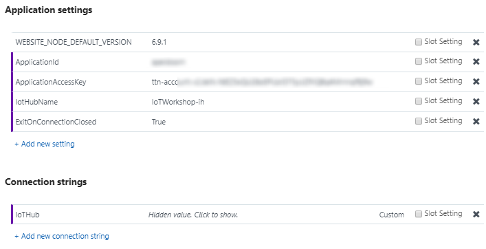

40. Press `Save`. A notification will be shown that the web app settings are updated successfully

    

41. Let's check the state of the Web Job. 
42. Filter the settings for `webjobs`. the bridge should have the state 'Running' by now.
43. Select the bridge and `Logs` of your Webjob

    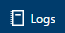

44. A new page is shown, here the status of the Web Job is shown. The status is 'Running'

    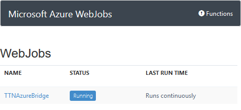

45. Go to the Detail logging, by selecting `the link` of the Web Job details. The TTN messages are handled 

    

You have now deployed the whole upstream to the Azure cloud. You have successfully accomplished all available steps of this workshop.

